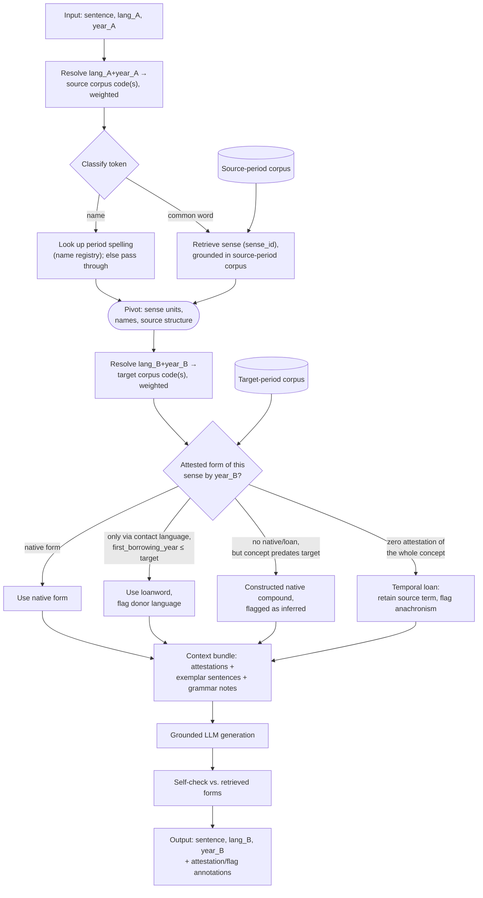

# Diachronic Translation Pipeline — Implementation Spec (v1)

**Status**: ready for implementation kickoff. Scope for v1: **English only** (`ang`/`enm`/`eng`). Other languages (French resources are already scoped — see §7) are deferred until the English pipeline works end to end.

## 0. Summary

A system that translates `(sentence, ISO 639 lang_code, year) → (sentence, ISO 639 lang_code, year)` — i.e. between any two points in a language's history (or between two languages' histories), not just "modern → old." It is retrieval-grounded, not fine-tuned: a pretrained multilingual sentence embedder indexes a corpus partitioned by `(lang_code, year)`; a resolver and temporal reranker pull the right period's attested forms; an LLM generates the output sentence constrained to those attested forms, with a self-check pass before returning. No model training is required anywhere in this pipeline — every component is either pretrained-and-used-as-is, or plain retrieval/rule logic.

## 1. Interface

```
translate(sentence: str, lang_A: str, year_A: int, lang_B: str, year_B: int) -> {
  sentence: str,
  annotations: [ { span, status: "attested" | "loan" | "constructed" | "anachronism-passthrough", note } ]
}
```

`lang_A`/`lang_B` are ISO 639-2/3 codes. `year_A == year_B` and `lang_A == lang_B` are both valid (identity case, useful for testing). `lang_A != lang_B` is valid (real cross-lingual+cross-temporal translation) but out of scope for the first working version — get same-language, cross-year working first.

## 2. Architecture



**Key design points, in one line each:**

- The resolver is the *only* place "which named period is this" gets decided — everything downstream sees weighted corpus partitions, not era labels.
- Names bypass sense-retrieval entirely (they don't have a concept to look up); a period name-form registry is a separate, small lookup.
- Retrieval is keyed on **sense_id, not literal lemma** — this is what makes both ordinary lexical substitution ("car" → "carriage") and anachronism detection work. Anachronism = zero attestation for the *entire sense*, not just this word.
- The fallback chain (native → loan → constructed → temporal-loan-passthrough) is one mechanism reused for two different real-world phenomena: language contact (loanwords) and language-vs-concept-age mismatch (anachronisms).

## 3. Data model

### 3a. Queryable index (what retrieval actually hits)

Built from validated contributions (§5) via an indexing job — this is *not* the same object as the contribution JSON format (§3b); contributions get transformed into this on validation.

| Field | Purpose |
|---|---|
| `iso_code`, `family_id` | e.g. `ang`/`enm`/`eng` all → family `en` |
| `code_valid_from`, `code_valid_to` | Nominal ISO range; center of the resolver's soft window |
| `form`, `lemma`, `sense_id` | Attested spelling, lemma, pivot sense unit |
| `attestation_year`, `source`, `doc_type` | When/where attested; `dictionary_entry` / `grammar_note` / `attestation` (running text) |
| `donor_language`, `first_borrowing_year` | For loans: donor, and when it entered *this* language (the actual gate) |
| `register`, `dialect` | vernacular/legal/ecclesiastical/literary; dialect group |
| `embedding` | Vector from the chosen multilingual encoder, for semantic/phrase-level lookup |

Indexing job, concretely: validated entries get (a) their text embedded and stored in a vector DB with `iso_code`/`year`/`doc_type` as filterable metadata, and (b) their structured fields (`lemma`, `first_borrowing_year`, `sense_id`, etc.) loaded into a relational table for exact-match/gating queries. Retrieval at translation time is hybrid: relational lookup for the fallback chain's exact gating logic, vector search for semantic/phrase-level and exemplar-sentence retrieval.

### 3b. Community contribution format (what gets submitted and reviewed)

```json
{
  "doc_type": "dictionary_entry",
  "origin": {
    "lang_code": "ang",
    "tokens": [
      { "surface": "lēoht", "alt": [], "class": null },
      { "surface": "bēam", "alt": ["beam"], "class": "common" },
      { "surface": null, "alt": [], "gap": true }
    ]
  },
  "target": { "lang_code": "eng", "text": "ray of light" },
  "metadata": {
    "date": { "year": 1000, "precision": "circa" },
    "location": "Wessex, England",
    "source": "Bosworth-Toller",
    "author": null,
    "contributor": "handle",
    "license": "CC-BY-SA-4.0",
    "validation": { "status": "pending" }
  }
}
```

- `tokens[].alt`: alternate readings for an ambiguous word/segment. `tokens[].gap: true`: illegible/missing text (lacuna). This is a lightweight JSON re-expression of TEI's `<choice>`/`<sic>`/`<corr>`/`<gap>` conventions from the digital-humanities world — reuse that concept rather than inventing new ones.
- `tokens[].class`: optional contributor-supplied hint (`"name"` / `"common"` / `"anachronism"`) — feeds directly into the classification stage in §2; the pipeline's own NER/anachronism-detection fills this in when a contributor leaves it null.
- `doc_type: "grammar_note"` entries have `origin.text` (free text) instead of tokenized `origin.tokens`, and `target: null` — they're retrieved as prose context for the LLM, not for word-level lookup.
- Enforce this with **JSON Schema** (draft 2020-12) — define once, validate every submission in CI, reject malformed submissions automatically before human review.

## 4. Components & methods (no training required anywhere)

| Component | Method | Notes |
|---|---|---|
| Cross-temporal/cross-lingual embedding | LaBSE, BGE-M3, multilingual-e5, or Cohere `embed-multilingual-v3` | Pretrained, used as-is; index partitioned by `(iso_code, year)` |
| Vector storage + filtering | pgvector / Weaviate / Qdrant | Metadata filter on resolver output + custom rerank |
| Temporal reranking | `score = similarity × exp(-λ · year_gap)` | Plain scoring function, not a model; λ is a tunable constant (see §8) |
| Finer word-level drift (optional upgrade) | Diachronic embedding alignment — Hamilton, Leskovec & Jurafsky 2016 (ACL) | Per-decade embeddings aligned via orthogonal Procrustes |
| Harder grounding at generation time (optional upgrade) | kNN-LM (Khandelwal et al. 2020) / kNN-MT (Khandelwal et al. 2021) | Frozen model + datastore, interpolated at decode time |
| Historical spelling normalization | VARD2 (Lancaster) | English EModE-focused; rules pluggable |
| Morphological tagging (English, historical) | MorphAdorner (Northwestern) | Lexicons for Early Modern English, 19th-c. fiction |
| Modern-side parsing / NER | spaCy or Stanza | For source sentences in a living stage; NER feeds the name-classification branch |
| Period name-form lookup | Dictionary of Medieval Names from European Sources (DMNES) | Given names attested 500–1600, dated |
| Loanword/anachronism gating | Rule-based fallback over the schema in §3a | Not a model |
| Manuscript transcription (for dataset ingestion) | Transkribus (READ-COOP) or eScriptorium (fully open-source) | For handwritten sources; general vision-LLM sufficient for printed text |

## 5. Contribution, validation & hosting

1. Contributor submits a JSON entry (§3b) or an image; if an image, an LLM structures the transcription (Transkribus/eScriptorium output, or vision-LLM OCR) into the JSON format.
2. CI validates against the JSON Schema on every pull request — malformed entries rejected automatically.
3. Human review before merge — mirrors Wikisource's tiered model (Not proofread → Proofread by one contributor → Validated by a second) via GitHub's PR review flow: one approving review before merge to `main`.
4. **Hosting**: GitHub for the contribution/review workflow (PRs, required reviews, schema CI, attribution history). Mirror validated releases to a Hugging Face Dataset repo for consumption — the retrieval pipeline's indexing job pulls from there via `load_dataset(...)`.

## 6. Build order (v1, English only)

1. `(eng, 1810) ↔ (eng, 2026)` using COHA alone. Single ISO code both sides, no resolver blending, no loanword/anachronism logic. **This validates the core loop end to end and is the first thing to build.**
2. Push `year_B` into `eng`'s early range (1500s–1700s): add EEBO-TCP + VARD2 normalization. Still single code, now inside the resolver's boundary-blending zone against `enm`.
3. Cross into `enm` (1100–1500) on the target side: first real test of the resolver, the loanword fallback chain, and the classification stage (names via DMNES, anachronism detection).
4. Cross into `ang` (pre-1100): hardest tier — grammar, not just vocabulary, has changed. First real test of the pivot representation and symmetric understand/generate.

## 7. Phase 2 languages (not needed for v1 — reference only)

**French**: `fro` (842–1400), `frm` (1400–1600), `fra` (1600–present). Resources: Base de Français Médiéval (BFM, 9th–15th c.), Frantext (12th c.–present, ATILF-CNRS), Dictionnaire du Moyen Français (1330–1500), DEAF (Old French etymology). Contact languages: Frankish, Latin (Dictionary of Medieval Latin from British Sources covers the English side; a Continental equivalent would be needed for French).

**English full resource list** (for when v1 needs more than COHA): Dictionary of Old English Corpus (`ang`, doe.utoronto.ca), Bosworth-Toller (`ang`), Helsinki Corpus of English Texts (`ang`→early `eng`), EEBO-TCP (`enm`/`eng`, textcreationpartnership.org), ARCHER (`eng`, 1600–1999), Historical Thesaurus of English (all periods, ht.ac.uk — doubles as the pivot sense scaffold), Anglo-Norman Dictionary (French-loan donor source, anglo-norman.net), Dictionary of Medieval Latin from British Sources (Latin-loan donor source, via Brepolis).

## 8. Open decisions — flag these rather than guessing silently

- Exact embedding model (LaBSE vs. BGE-M3 vs. multilingual-e5) — pick based on what's easiest to self-host vs. API-only for the MVP.
- Value of λ in the temporal-decay reranker — needs empirical tuning once real query examples exist; no principled default.
- Whether the kNN-MT-style harder-grounding upgrade is needed for v1, or only once plain retrieval-augmented prompting proves insufficient (start without it).
- Whether `register`/`dialect` are exposed as API parameters in v1 or deferred until multiple values actually exist in the indexed data.
- The "constructed compound" fallback rung is the least well-specified part of the chain — needs a concrete method (LLM-proposed compound checked against period-productive morphology rules?) before it's implementable, not just retrieval.
- No custom validation UI is being built for v1 — plain GitHub PR review is the mechanism. Revisit only if contribution volume outgrows that.

## 9. Suggested first task for implementation

Build step 1 of §6 only: ingest COHA into the schema in §3a (skip §3b/community format for now — this is a bootstrapping corpus, not a community contribution), embed with one off-the-shelf multilingual encoder, store in pgvector, implement the temporal-decay rerank, and wire a plain grounded-prompting call (no classification stage, no fallback chain, no pivot) to translate `(eng, 2026) → (eng, 1850)` and back. Get that round-trip working before adding any of the harder pieces above.

## 10. How to hand this to another Claude Code session

Paste this whole document as your opening message (or attach it as a file) in the new session, then say something like:

> I'm building the pipeline described in this spec. Let's start with §9 (the first task). Set up the project structure, then implement the COHA ingestion → embedding → pgvector → temporal rerank → grounded-prompt round trip. Ask me before making a choice listed under §8 (Open decisions) rather than guessing.

That gives the new session the full architecture up front, points it at a scoped starting task instead of the whole system at once, and tells it explicitly which decisions to check with you on rather than silently picking one.
