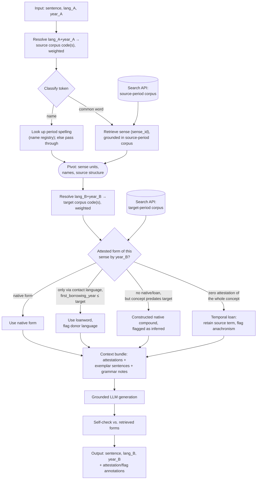

# Diachronic Translation Pipeline — Implementation Spec (v1)

**Status**: §6/§10's first build task (§11) is done and live — see §13e for exactly what has real data behind it today. Scope for v1: **English only** (`ang`/`enm`/`eng`). Other languages (French resources are already scoped — see §8) are deferred until the English pipeline works end to end.

## 0. Summary

A system that translates `(sentence, ISO 639 lang_code, year) → (sentence, ISO 639 lang_code, year)` — i.e. between any two points in a language's history (or between two languages' histories), not just "modern → old." It is retrieval-grounded, not fine-tuned: a pretrained multilingual sentence embedder indexes a corpus partitioned by `(lang_code, year)`; a resolver and temporal reranker pull the right period's attested forms; an LLM generates the output sentence constrained to those attested forms, with a self-check pass before returning. No model training is required anywhere in this pipeline — every component is either pretrained-and-used-as-is, or plain retrieval/rule logic.

The retrieval/indexing layer is served as a **standalone Search API** (§10), not embedded local code — the rest of the pipeline (resolver, fallback chain, generation) is a thin HTTP client of it. This keeps the large corpus/index artifacts off the Pi 5 deployment target entirely.

## 1. Interface

```
translate(sentence: str, lang_A: str, year_A: int, lang_B: str, year_B: int) -> {
  sentence: str,
  annotations: [ { span, status: "attested" | "loan" | "constructed" | "anachronism-passthrough", note } ]
}
```

`lang_A`/`lang_B` are ISO 639-2/3 codes. `year_A == year_B` and `lang_A == lang_B` are both valid (identity case, useful for testing). `lang_A != lang_B` is valid (real cross-lingual+cross-temporal translation) but out of scope for the first working version — get same-language, cross-year working first.

## 2. Architecture



**Key design points, in one line each:**

- The resolver is the *only* place "which named period is this" gets decided — everything downstream sees weighted corpus partitions, not era labels.
- Names bypass sense-retrieval entirely (they don't have a concept to look up); a period name-form registry is a separate, small lookup.
- Retrieval is keyed on **sense_id, not literal lemma** — this is what makes both ordinary lexical substitution ("car" → "carriage") and anachronism detection work. Anachronism = zero attestation for the *entire sense*, not just this word.
- The fallback chain (native → loan → constructed → temporal-loan-passthrough) is one mechanism reused for two different real-world phenomena: language contact (loanwords) and language-vs-concept-age mismatch (anachronisms).
- Both `SRC` and `TGT` above are the same physical thing: one call to the Search API (§10), parameterized by resolved corpus code(s). The pipeline never talks to a vector store or database directly.

## 3. Data model

### 3a. Queryable index (what retrieval actually hits)

Built from validated contributions (§5) and aligned example pairs (§3c) via an indexing job — this is *not* the same object as the contribution JSON format (§3b); both get transformed into this on validation/alignment.

| Field | Purpose |
|---|---|
| `iso_code`, `family_id` | e.g. `ang`/`enm`/`eng` all → family `en` |
| `code_valid_from`, `code_valid_to` | Nominal ISO range; center of the resolver's soft window |
| `form`, `lemma`, `sense_id` | Attested spelling, lemma, pivot sense unit |
| `attestation_year`, `source`, `doc_type` | When/where attested; `dictionary_entry` / `grammar_note` / `attestation` (running text) |
| `donor_language`, `first_borrowing_year` | For loans: donor, and when it entered *this* language (the actual gate) |
| `register`, `dialect` | vernacular/legal/ecclesiastical/literary; dialect group |
| `embedding` | Vector from the chosen multilingual encoder, for semantic/phrase-level lookup |

Indexing job, concretely: validated entries get (a) their text embedded and stored in a vector index with `iso_code`/`year`/`doc_type` as filterable metadata, and (b) their structured fields (`lemma`, `first_borrowing_year`, `sense_id`, etc.) loaded into a relational/columnar table for exact-match/gating queries. Retrieval at translation time is hybrid: exact lookup for the fallback chain's gating logic, vector search for semantic/phrase-level and exemplar-sentence retrieval. Both halves live behind the Search API (§10), not in the translation pipeline's process.

This table is the *logical* schema — every row always carries `iso_code` and `attestation_year` regardless of how sparse or dense that language/period is. How those rows get split across physical files (by language, and by volume within a language) is a storage concern, not a schema concern — see §10.

### 3b. Community contribution format (what gets submitted and reviewed)

```json
{
  "doc_type": "dictionary_entry",
  "origin": {
    "lang_code": "ang",
    "tokens": [
      { "surface": "lēoht", "alt": [], "class": null },
      { "surface": "bēam", "alt": ["beam"], "class": "common" },
      { "surface": null, "alt": [], "gap": true }
    ]
  },
  "target": { "lang_code": "eng", "text": "ray of light" },
  "metadata": {
    "date": { "year": 1000, "precision": "circa" },
    "location": "Wessex, England",
    "source": "Bosworth-Toller",
    "author": null,
    "contributor": "handle",
    "license": "CC-BY-SA-4.0",
    "validation": { "status": "pending" }
  }
}
```

- `tokens[].alt`: alternate readings for an ambiguous word/segment. `tokens[].gap: true`: illegible/missing text (lacuna). This is a lightweight JSON re-expression of TEI's `<choice>`/`<sic>`/`<corr>`/`<gap>` conventions from the digital-humanities world — reuse that concept rather than inventing new ones.
- `tokens[].class`: optional contributor-supplied hint (`"name"` / `"common"` / `"anachronism"`) — feeds directly into the classification stage in §2; the pipeline's own NER/anachronism-detection fills this in when a contributor leaves it null.
- `doc_type: "grammar_note"` entries have `origin.text` (free text) instead of tokenized `origin.tokens`, and `target: null` — they're retrieved as prose context for the LLM, not for word-level lookup.
- Enforce this with **JSON Schema** (draft 2020-12) — define once, validate every submission in CI, reject malformed submissions automatically before human review.

### 3c. Aligned example-pair record (Linguee-style, machine-generated — not hand-contributed)

Produced by the alignment pipeline (§6), not submitted by contributors. This is what makes "type a word from year_A, see it highlighted inside a real attested sentence from year_B" possible — §3a alone (a bag of dictionary senses) cannot do this; it needs two genuinely time-parallel sentences plus a span-to-span link between them.

```json
{
  "pair_id": "wycliffe1382_nrsv1989_gen1-3_000042",
  "source": {
    "lang_code": "enm", "year": 1382,
    "work": "Wycliffe Bible", "citation": "Genesis 1:3",
    "text": "And God seide, Liyt be maad, and liyt was maad.",
    "tokens": ["And","God","seide",",","Liyt","be","maad",",","and","liyt","was","maad","."]
  },
  "target": {
    "lang_code": "eng", "year": 1989,
    "work": "NRSV", "citation": "Genesis 1:3",
    "text": "Then God said, \"Let there be light\"; and there was light.",
    "tokens": ["Then","God","said",",","\"","Let","there","be","light","\"",";","and","there","was","light","."]
  },
  "alignment": {
    "sentence_method": "embedding-margin (multilingual-e5-large)",
    "sentence_confidence": 0.94,
    "word_method": "awesome-align",
    "links": [
      { "source_idx": [4], "target_idx": [8], "sense_id": "en:light.n.01" },
      { "source_idx": [2], "target_idx": [2], "sense_id": "en:say.v.01" }
    ]
  },
  "embedding": {
    "model": "intfloat/multilingual-e5-large",
    "source_vector": [0.0123, -0.0456, "…"],
    "target_vector": [0.0089, -0.0321, "…"]
  },
  "metadata": { "license": "public-domain", "ingested_at": "2026-09-21T00:00:00Z" }
}
```

Two data tracks feed this, and they are not interchangeable:

- **Parallel/comparable diachronic texts** (same content, re-rendered at different points in the language's history — e.g. multiple Bible translations 1382→2011, Beowulf/Canterbury Tales facing-page modern editions, historical statute re-codifications). These are the *only* source that supports real sentence+word alignment, because they are actual translations of the same content, the same way Linguee's bilingual document pairs are.
- **Monolingual per-period corpora** (COHA, EEBO-TCP, DOE Corpus). These have no cross-period counterpart sentence to align against — they feed §3a (attestation, frequency, anachronism gating) but not §3c. Don't expect a word-highlight example pair out of COHA alone; it wasn't built for that.

## 4. Components & methods (no training required anywhere)

| Component | Method | Notes |
|---|---|---|
| Cross-temporal/cross-lingual embedding | LaBSE, BGE-M3, multilingual-e5, or Cohere `embed-multilingual-v3` | Pretrained, used as-is; index partitioned by `(iso_code, year)` |
| Sentence alignment (§3c pairs) | Embedding + margin scoring (Vecalign / Bleualign), or length-based Gale-Church as a cheap fallback | Reuses the same embedder as retrieval; margin scoring rejects false matches |
| Word alignment (§3c `links`) | fast_align (statistical) or awesome-align (embedding/attention-based) | Run once per aligned sentence pair at indexing time, not at query time |
| Vector + exact-match storage | Served behind the Search API (§10): Parquet for exact/relational fields, FAISS (or a `datasets`-native FAISS index) for vector search | Not self-hosted pgvector/Weaviate/Qdrant for v1 — no infra to run, stays free |
| Temporal reranking | `score = similarity × exp(-λ · year_gap)` | Plain scoring function, not a model; λ is a tunable constant (see §9) |
| Finer word-level drift (optional upgrade) | Diachronic embedding alignment — Hamilton, Leskovec & Jurafsky 2016 (ACL) | Per-decade embeddings aligned via orthogonal Procrustes |
| Harder grounding at generation time (optional upgrade) | kNN-LM (Khandelwal et al. 2020) / kNN-MT (Khandelwal et al. 2021) | Frozen model + datastore, interpolated at decode time |
| Historical spelling normalization | VARD2 (Lancaster) | English EModE-focused; rules pluggable |
| Morphological tagging (English, historical) | MorphAdorner (Northwestern) | Lexicons for Early Modern English, 19th-c. fiction |
| Modern-side parsing / NER | spaCy or Stanza | For source sentences in a living stage; NER feeds the name-classification branch |
| Period name-form lookup | Dictionary of Medieval Names from European Sources (DMNES) | Given names attested 500–1600, dated |
| Loanword/anachronism gating | Rule-based fallback over the schema in §3a | Not a model |
| Manuscript transcription (for dataset ingestion) | Transkribus (READ-COOP) or eScriptorium (fully open-source) | For handwritten sources; general vision-LLM sufficient for printed text |

## 5. Contribution, validation & hosting

1. Contributor submits a JSON entry (§3b) or an image; if an image, an LLM structures the transcription (Transkribus/eScriptorium output, or vision-LLM OCR) into the JSON format.
2. CI validates against the JSON Schema on every pull request — malformed entries rejected automatically.
3. Human review before merge — mirrors Wikisource's tiered model (Not proofread → Proofread by one contributor → Validated by a second) via GitHub's PR review flow: one approving review before merge to `main`.
4. **Hosting**: GitHub for the contribution/review workflow (PRs, required reviews, schema CI, attribution history) and for the Search API's own code. Validated §3b contributions and machine-generated §3c aligned pairs are both mirrored to a Hugging Face Dataset repo — the indexing job and the Search API both read from there. See §10 for the full serving architecture.

## 6. Data acquisition & alignment pipeline (Linguee-style — first build phase)

This is the actual first thing to build, ahead of anything in §7. It produces the §3c aligned-pair records that make word-level, in-context lookup possible.

1. **Gather parallel/comparable diachronic texts.** Start with the best-documented multi-century case: Bible translations (Wycliffe 1382 → Tyndale 1526 → KJV 1611 → RSV 1952 → NRSV 1989 → a contemporary paraphrase), all public domain or permissively licensed, all verse-aligned by construction (chapter:verse is a built-in ground-truth key — use it to sanity-check the automatic sentence alignment in step 2 rather than trusting alignment blind). Secondary candidates once the pipeline works: Beowulf/Canterbury Tales facing-page modern translations, historical statute re-codifications.
2. **Sentence-align.** Embed every candidate sentence on both sides with the project's embedder (multilingual-e5-large), nearest-neighbor + margin-score to propose pairs, filter on length-ratio sanity and confidence threshold. Where a built-in key exists (Bible verse numbers), use it to validate the aligner's precision before trusting it on unkeyed text.
3. **Word-align.** Run awesome-align (or fast_align) over every accepted sentence pair to get token-span links. Attach a `sense_id` to each link — reuse whatever sense inventory §3a's dictionary-entry ingestion already establishes, don't invent a second one.
4. **Format & index.** Emit §3c records, push to the Hugging Face Dataset repo as Parquet (exact fields) + a FAISS index (vectors). This is the dataset the Search API (§10) serves.

## 7. Build order (v1, English only)

1. **Run §6 end to end on one parallel-text source** (Bible translations) and stand up the minimal Search API (§10) in front of the resulting index. This validates the whole "gather → align → index → serve → query" loop and is the true first deliverable — before it exists, nothing downstream has real data to call.
2. `(eng, 1810) ↔ (eng, 2026)` using COHA, fed into §3a alongside the §3c pairs from step 1. Single ISO code both sides, no resolver blending, no loanword/anachronism logic yet.
3. Push `year_B` into `eng`'s early range (1500s–1700s): add EEBO-TCP + VARD2 normalization. Still single code, now inside the resolver's boundary-blending zone against `enm`.
4. Cross into `enm` (1100–1500) on the target side: first real test of the resolver, the loanword fallback chain, and the classification stage (names via DMNES, anachronism detection).
5. Cross into `ang` (pre-1100): hardest tier — grammar, not just vocabulary, has changed. First real test of the pivot representation and symmetric understand/generate.

## 8. Phase 2 languages (not needed for v1 — reference only)

**French**: `fro` (842–1400), `frm` (1400–1600), `fra` (1600–present). Resources: Base de Français Médiéval (BFM, 9th–15th c.), Frantext (12th c.–present, ATILF-CNRS), Dictionnaire du Moyen Français (1330–1500), DEAF (Old French etymology). Contact languages: Frankish, Latin (Dictionary of Medieval Latin from British Sources covers the English side; a Continental equivalent would be needed for French).

**English full resource list** (for when v1 needs more than COHA): Dictionary of Old English Corpus (`ang`, doe.utoronto.ca), Bosworth-Toller (`ang`), Helsinki Corpus of English Texts (`ang`→early `eng`), EEBO-TCP (`enm`/`eng`, textcreationpartnership.org), ARCHER (`eng`, 1600–1999), Historical Thesaurus of English (all periods, ht.ac.uk — doubles as the pivot sense scaffold), Anglo-Norman Dictionary (French-loan donor source, anglo-norman.net), Dictionary of Medieval Latin from British Sources (Latin-loan donor source, via Brepolis).

**Diachronic parallel-text candidates for §6** (French, for when Phase 2 starts): historical French Bible translations (comparable staging to English), Chanson de Roland facing-page modern editions.

## 9. Open decisions — flag these rather than guessing silently

- Exact embedding model (LaBSE vs. BGE-M3 vs. multilingual-e5) — pick based on what's easiest to self-host vs. API-only for the MVP.
- Which parallel-text source to start §6 with beyond the Bible (chosen above for its built-in verse-key ground truth) — revisit once that source is exhausted.
- Value of λ in the temporal-decay reranker — needs empirical tuning once real query examples exist; no principled default.
- Whether the kNN-MT-style harder-grounding upgrade is needed for v1, or only once plain retrieval-augmented prompting proves insufficient (start without it).
- Whether `register`/`dialect` are exposed as API parameters in v1 or deferred until multiple values actually exist in the indexed data.
- The "constructed compound" fallback rung is the least well-specified part of the chain — needs a concrete method (LLM-proposed compound checked against period-productive morphology rules?) before it's implementable, not just retrieval.
- No custom validation UI is being built for v1 — plain GitHub PR review is the mechanism. Revisit only if contribution volume outgrows that.
- Search API auth/rate-limiting **for its own clients** — still deferred; v1 assumes a public, unauthenticated, free-tier-hosted read endpoint (`--allow-unauthenticated` on Cloud Run). This is unrelated to the search_api → Hugging Face leg below, which does need a token now.
- `/search`'s ~77s cold start (re-downloading the 2.2GB embedding model on every scale-to-zero cycle) — deliberately left as-is for now, taking the delay rather than adding complexity/cost while traffic is low. See §13e for the two low-cost fixes (bake the model into the image; switch to a smaller e5 variant) queued for whenever this matters at scale.

## 10. Search API — hosting & serving

The rest of the pipeline never touches the corpus, the vector index, or a database directly. It calls one HTTP API. This keeps the large data artifacts entirely off the Pi 5 deployment target and off every contributor's machine.

- **Data storage — Hugging Face Dataset repo.** Free, public, git-lfs-backed, no practical size ceiling for this project's scale. Published via `huggingface_hub`/`datasets` `push_to_hub` — this was already the plan in §5 point 4, §10 is just the part that serves it. Two artifacts per shard (below): a Parquet table (§3a exact/relational fields + §3c pair metadata) and a matching FAISS index file (embeddings for both §3a entries and §3c pairs). *Public doesn't mean tokenless*: Hugging Face rate-limits fully anonymous API reads (discovered live, deploying this), so `search_api` authenticates to HF with a token even though the repo itself needs no auth to read — that token is a Secret Manager secret (`hf-token`) referenced by the Cloud Run service, never a plain env var or a value in a command line/GitHub secret.

- **Physical partitioning: by language, then by volume — never a fixed calendar grid.**
  - **Language tier.** Full-treatment languages (`ang`, `enm`, `eng` — the actual translation-target languages) each get relational + FAISS + §3c pair shards. Donor-only contact languages (Anglo-Norman/Old French `fro`/`xno`, Medieval Latin `lat`, eventually Frankish) get relational shards only — no embeddings, no alignment — since they're read only by the loanword fallback branch (§2, `SENSE →|loan| LN`), never by semantic/exemplar retrieval.
  - **Volume split, within a language.** The indexing job sorts a language's rows by `attestation_year`, and leaves them as one file below a size/row-count threshold. Once a language crosses the threshold, it's cut into **quantile-based** chunks by year — boundaries chosen so each shard holds roughly equal *data volume*, not equal calendar span. A shard's filename carries the actual min–max year found in it (e.g. `eng/1600-1634.parquet`), discovered from the data, never pre-declared. Dense stretches (17th-c. English) end up as several narrow-year shards; sparse stretches (`ang`, most of `enm`, all donor languages) stay as one file indefinitely.
  - **Why this matters operationally**: a small contribution to a sparse era only touches that era's small shard — nothing else gets rewritten or re-uploaded. A shard only splits further when *it itself* crosses the threshold, and only that shard is rewritten when it does. No language's data is ever reorganized because of activity in a different language or a different era.
  - **Within a shard**, rows stay sorted by `attestation_year` so Parquet's own row-group min/max statistics let readers (`pyarrow.dataset`, DuckDB) skip irrelevant row groups on a year-range query — pruning below the shard level costs nothing extra to set up.

  ```
  relational/
  ├── eng/
  │   ├── 1600-1634.parquet
  │   ├── 1635-1671.parquet
  │   └── 1672-2026.parquet
  ├── enm/
  │   └── 1100-1500.parquet        # sparse — one file, no split yet
  ├── ang/
  │   └── 450-1100.parquet         # sparse — one file
  ├── fro/                         # donor-only, no embeddings
  │   └── 842-1600.parquet
  └── lat/                         # donor-only, no embeddings
      └── 1-1500.parquet
  vectors/                         # mirrors the same shard boundaries as relational/ and pairs/
  ├── eng/1600-1634.faiss          # relational vectors — not built yet, no contribution data exists
  ├── eng/1635-1671.faiss
  ├── pairs/
  │   └── enm_eng/1400-1999.faiss  # implemented: ye_olde.ingest.index, one shard per pairs/ shard
  └── …
  ```

  `vectors/pairs/<lang_a>_<lang_b>/<year_from>-<year_to>.faiss` holds one L2-normalized embedding per side (`source_text`, `target_text`) of every row in the *identically-named* `pairs/` shard — `id = row_index * 2` (`+1` for the target side). That id is only meaningful paired with that exact shard's own row order, so a vector shard and its Parquet counterpart are always downloaded and read together, never merged across shards before resolving a hit back to a row (see `ye_olde.ingest.index` and `search_api/app/loader.py`'s `load_pair_shards_with_vectors`).
- **Compute — Google Cloud Run, free "Always Free" tier.** A small FastAPI app (`search_api/`, not Gradio — this is a pure JSON API, no UI needed) that on request downloads the current Parquet + FAISS files from the Dataset repo (`hf_hub_download`) and loads them into memory/`mmap`. Cloud Run's free tier (2M requests/mo, 360k GB-seconds, 180k vCPU-seconds — a standing monthly quota, not a trial) covers this project's scale indefinitely; the service scales to zero, so idle time costs nothing. *Revised from the original plan*: Hugging Face discontinued free CPU-tier Docker/Gradio Spaces mid-2026 — data storage stayed on the free HF Dataset repo (unaffected), only compute moved. Cold-starts on the first request after idle are the same acceptable-for-v1 tradeoff the original plan already accepted.
- **Endpoints (v1, minimal):**
  - `GET /lookup?text=…&lang=…&year=…&target_lang=…&target_year=…` — the Linguee-style query: given a word/phrase at one point in the language's history, return attested sentences at the other point with the corresponding span highlighted. Backed by §3c pairs + word-alignment links. Token-exact matching only.
  - `GET /search?text=…&lang=…&year=…&window=…&top_k=…` — semantic passage search: ranks indexed passages by embedding similarity rather than requiring an exact match, across every language pair that has `lang` on either side. This is the vector half of the index (below) actually being queried — the RAG-style "find a sentence, not just an exact word" retrieval the rest of the pipeline (and eventually `generation/`'s context-bundle step, §2) needs. Embeds the query at request time with the same model the shards were indexed with (`EMBEDDING_MODEL`) — a real dependency/memory cost added to the service, flagged in `search_api/README.md`.
  - `GET /attest?lemma=…&lang=…&year=…` — exact/relational lookup over §3a (attestation, loan, anachronism gating) — what the fallback chain (§2) actually calls.
  - `GET /health`.
- **Code hosting — GitHub**, same repo as everything else. `.github/workflows/deploy-search-api.yml` deploys `search_api/` to Cloud Run on every push to `main` that touches it, authenticating via Workload Identity Federation (short-lived OIDC tokens minted per CI run) rather than a downloadable service-account key — Cloud Run requires a billing-enabled GCP account, so a long-lived static credential sitting in a GitHub secret would be a real-money risk if it ever leaked; WIF avoids that by never issuing one.
- **Client side**: `src/ye_olde/retrieval/` (and anything in the fallback chain that currently assumes a local vector-store client) becomes a thin `httpx` client against `SEARCH_API_URL` from config — this replaces the self-hosted pgvector/Weaviate/Qdrant line item that was in §4 before this section existed. Nothing about self-hosting a vector database is free or zero-maintenance; this is.

## 11. Suggested first task for implementation

Build §6 end to end against one source (Bible translations) and stand up the minimal §10 Search API in front of it: ingest → sentence-align → word-align → format into §3c records → push Parquet+FAISS to a Hugging Face Dataset repo → FastAPI Space that serves `/lookup`. Confirm the loop with a manual query before wiring `translate()` (§1) to call it — no classification stage, no fallback chain, no pivot yet. Get that round-trip (gather → align → index → serve → query) working before adding any of the harder pieces above.

## 12. How to hand this to another Claude Code session

Paste this whole document as your opening message (or attach it as a file) in the new session, then say something like:

> I'm building the pipeline described in this spec. Let's start with §11 (the first task) — §6's data acquisition/alignment pipeline plus the §10 Search API, using Bible translations as the first parallel-text source. Ask me before making a choice listed under §9 (Open decisions) rather than guessing.

That gives the new session the full architecture up front, points it at a scoped starting task instead of the whole system at once, and tells it explicitly which decisions to check with you on rather than silently picking one.

## 13. Operations — accessing and administering the deployed infrastructure

Written for whichever Claude Code session (or human) next needs to touch the live Search API. Everything here is either non-secret (safe to also be in the public README, and most of it is) or already resolved to where the actual secret lives — nothing below requires guessing a credential.

### 13a. Where things are, concretely

| Thing | Value |
|---|---|
| GCP account | `sirchaos6@gmail.com` |
| GCP project | `ye-olde-search-api` (project number `1086548285460`) |
| Cloud Run service | `ye-olde-search-api`, region `us-central1` |
| Service URL(s) | `https://ye-olde-search-api-say7jittea-uc.a.run.app` (stable) and `https://ye-olde-search-api-1086548285460.us-central1.run.app` (numeric alias) — both route to the same service |
| Deploy service account | `search-api-deployer@ye-olde-search-api.iam.gserviceaccount.com` — what GitHub Actions impersonates via WIF to build/deploy |
| Runtime service account | `1086548285460-compute@developer.gserviceaccount.com` — the default compute SA the *container itself* runs as; this is what needs (and has) `roles/secretmanager.secretAccessor` on `hf-token` |
| Workload Identity pool/provider | `github-pool` / `github-provider`, full resource name `projects/1086548285460/locations/global/workloadIdentityPools/github-pool/providers/github-provider` — scoped by `--attribute-condition="assertion.repository=='dahrs/ye_olde'"`, i.e. only Actions runs from that exact GitHub repo can deploy |
| Secret Manager secret | `hf-token` (project `ye-olde-search-api`) — the HF token, referenced by the deploy workflow as `HF_TOKEN=hf-token:latest`, never a GitHub secret |
| HF Dataset repo | [`dahrs/ye_olde_data-index`](https://huggingface.co/datasets/dahrs/ye_olde_data-index) — public |
| GitHub repo | `dahrs/ye_olde` |
| Workflows | `.github/workflows/deploy-search-api.yml` (Cloud Run deploy, on push touching `search_api/**`), `lint-and-test.yml`, `validate-contributions.yml` |
| GitHub Actions secrets | `GCP_WORKLOAD_IDENTITY_PROVIDER`, `GCP_SERVICE_ACCOUNT` |
| GitHub Actions variables | `GCP_PROJECT_ID`, `GCP_REGION`, `HF_DATASET_REPO_ID` |

**Secrets, and only secrets, live outside this list**: the HF write token is in `search_api/.env` (gitignored, local dev/admin use) and as the `hf-token` Secret Manager secret (production, what the running service actually reads). It is never a GitHub secret, never a plain Cloud Run env var, and never appears as a literal value in any command — every `gcloud` invocation below that touches it reads from a file, not a command-line argument (see §10's credential-leakage note; a `gcloud run services update --update-env-vars="HF_TOKEN=$TOKEN"` was flagged and blocked by a safety check for exactly this reason during setup).

### 13b. GCP auth on this machine

`gcloud` is installed (`~/google-cloud-sdk`) and already authenticated as `sirchaos6@gmail.com` (`~/.config/gcloud`) — this project's Claude Code session runs directly on the user's own machine, not an isolated sandbox, so a fresh session can generally run the commands below immediately without re-authenticating. If `gcloud config get-value account` doesn't return `sirchaos6@gmail.com`, that state was cleared and needs `gcloud auth login` again (device-flow: run it, the user opens the printed URL in their own browser, pastes back the verification code — Google requires that interactively from the account owner, it can't be automated further).

### 13c. Common operational commands

```
# Service status
gcloud run services describe ye-olde-search-api --region=us-central1 --project=ye-olde-search-api

# Tail recent logs
gcloud run services logs read ye-olde-search-api --region=us-central1 --project=ye-olde-search-api --limit=50

# Manual redeploy (bypasses GitHub Actions — same effect as pushing to main,
# useful for fast local iteration on search_api/ before committing). --memory/--cpu
# are explicit here (not just left at whatever the previous revision had) because
# sentence-transformers + the e5-large model (added for /search) genuinely need
# the headroom — the original 512Mi/1vCPU default OOMs on the first /search call.
gcloud run deploy ye-olde-search-api --source=search_api \
  --region=us-central1 --project=ye-olde-search-api --allow-unauthenticated \
  --memory=4Gi --cpu=2 \
  --update-env-vars="HF_DATASET_REPO_ID=dahrs/ye_olde_data-index" \
  --update-secrets="HF_TOKEN=hf-token:latest"

# Rotate the HF token: write the NEW token to a file first (never inline on
# the command line — see 13a), no trailing newline (a prior rotation broke
# the Authorization header this way — strip it explicitly):
#   printf '%s' '<new-token>' > /path/to/token.secret
gcloud secrets versions add hf-token --project=ye-olde-search-api --data-file=/path/to/token.secret
# then redeploy (above) to force already-running instances to pick it up —
# :latest resolves at container start, so a warm instance keeps its old copy
# until it restarts.

# Smoke test
curl "https://ye-olde-search-api-say7jittea-uc.a.run.app/health"
curl "https://ye-olde-search-api-say7jittea-uc.a.run.app/lookup?text=gladly&lang=enm&year=1400&target_lang=eng&target_year=1999"
curl "https://ye-olde-search-api-say7jittea-uc.a.run.app/search?text=greetings,%20sir&lang=enm&top_k=3"
# first call after idle: ~60-80s (model re-download, cold start); warm: ~1-2s
```

### 13d. Pushing new data to the index

`search_api` never builds an index, only serves what's already in the HF Dataset repo (§10's shard layout: `relational/<iso_code>/...`, `pairs/<lang_a>_<lang_b>/...`, `vectors/pairs/<lang_a>_<lang_b>/...`). The ingestion side writes shards locally (`scripts/align_corpus.py` → `scripts/build_index.py` → `data/index/`); pushing them to HF is a separate, currently-manual step:

```python
from huggingface_hub import HfApi
HfApi(token=hf_token).upload_file(
    path_or_fileobj="data/index/pairs/enm_eng/1400-1999.parquet",
    path_in_repo="pairs/enm_eng/1400-1999.parquet",   # must match the shard-naming convention, §10
    repo_id="dahrs/ye_olde_data-index",
    repo_type="dataset",
)
```

`search_api`'s file listing is cached per-process (`loader._list_repo_files`, no TTL) — a newly-pushed shard is picked up automatically only once the Cloud Run container restarts (a fresh cold start after scale-to-zero, or a new revision from a redeploy). There's no live-refresh endpoint yet; triggering a manual redeploy (13c) after a data push is the reliable way to see it immediately.

### 13e. How the Search API actually works (current real state)

Three endpoints, three different data dependencies — worth knowing which currently have real data behind them:

- **`GET /lookup`** (spec §3c) — token-exact match against `pairs/` shards. **Has real data**: `pairs/enm_eng/1400-1999.parquet`, 704 sentence pairs from *Sir Gawayne and the Green Knight* (enm 1400 ↔ eng 1999), partially word-aligned (689/704 rows have real `alignment_links`; a handful don't yet). Handles query direction per-row — each row carries its own `source.lang_code`/`target.lang_code`, so a shard stored `enm→eng` still answers an `eng→enm` query correctly (§10, the directionality fix) — rather than assuming the shard's stored order matches the query's order.
- **`GET /attest`** (spec §3a) — exact/relational lookup for the loanword/anachronism fallback chain. **No data yet** — nothing has been pushed to `relational/`, so this always returns `results: []`. Not a bug; §3a data (dictionary-style attestation entries) hasn't been built by the ingestion side yet, only §3c pairs have.
- **`GET /search`** (spec §10) — semantic passage search: embeds the query at request time (`sentence-transformers`, same model the shards were built with) and does a FAISS nearest-neighbor search. **Deployed and has real data**: `vectors/pairs/enm_eng/1400-1999.faiss` was pushed alongside the Parquet shard, and the endpoint is live (revision `ye-olde-search-api-00010-gc6` deployed 2026-09-24 with `--memory=4Gi --cpu=2`, up from the default 512Mi/1vCPU — sentence-transformers + the e5-large model need real headroom). Verified live: bidirectional (`lang=eng` correctly matches against the `enm` side of a pair and vice versa), ranks by meaning not exact wording. **Cold start is real and slow**: ~77s measured live — the model (~2.2GB) re-downloads from the HF Hub on every cold start, since Cloud Run's ephemeral storage doesn't persist between instances. This is a *per-cold-start* cost, not per-call: Cloud Run keeps an idle instance warm for ~15 minutes of no traffic before scaling it to zero ([Google Cloud docs](https://docs.cloud.google.com/run/docs/about-instance-autoscaling)), and any request that arrives while an instance is still warm reuses the already-loaded model (~1.4s, measured) — the 77s only recurs after another 15-minute idle gap closes the instance. `embedding.py` passes the HF token on this download (not just for the data shards) to avoid anonymous-read rate-limiting, but the download time itself isn't addressed. **Deliberately not fixed yet** — the fix is well understood, just deferred until cold-start latency actually matters at scale:
  - **Option A (recommended first step)**: bake the model into the Docker image at build time (pre-download during `docker build`, then set `HF_HUB_OFFLINE=1` at runtime so it never touches the network) — turns cold start into a local file load, which should be close to the ~1-5s already measured once weights are local, instead of a 2.2GB internet download. Stays free (no standing cost, still scales to zero); the only cost is the image exceeding Artifact Registry's small free storage tier by a couple GB (~$0.20-0.30/month).
  - **Option B**: switch to a smaller e5 variant (`multilingual-e5-base`, ~1.1GB, or `-small`, ~470MB) — shrinks both the download and the image, combinable with Option A. Cheap to do *now* (only 1,408 vectors to re-embed) but gets expensive to change later once real data volume exists, so this is the one open decision worth revisiting before the corpus grows much further.
  - **Considered and rejected for now**: `--min-instances=1` (keep an instance always warm) eliminates cold start entirely, but costs money continuously (~$15-25/month) whether or not anyone queries the service — directly against the project's free-tier-only stance, so not pursued unless zero-delay-no-exceptions becomes an actual requirement.

Shared plumbing across all three (`search_api/app/loader.py`): every shard lookup is soft-fail (missing repo, missing shard, missing vector file → empty result, never an error) — deliberate, so the service is meaningfully testable before any real corpus exists (§11). Shard filenames are parsed as `<prefix>/<start>-<end>.parquet` to support the volume-triggered year-range partitioning from §10; a `pairs/` shard's `<lang_a>_<lang_b>` directory name is tried both ways (`load_pairs("eng", "enm")` also checks `pairs/enm_eng/`) since the physical file only exists in whichever direction the alignment job happened to run.
