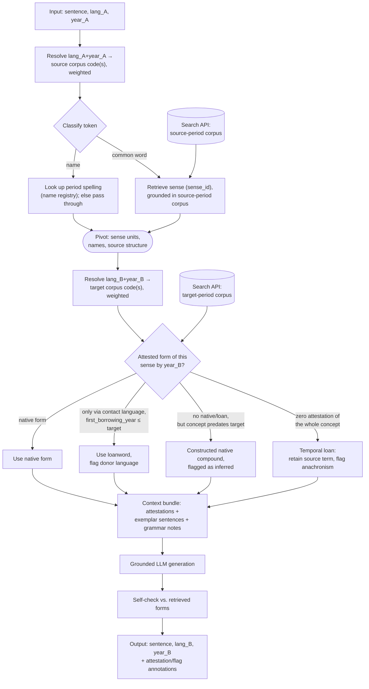

# Diachronic Translation Pipeline — Implementation Spec (v1)

**Status**: §6/§10's first build task (§11) is done and live — see §13e for exactly what has real data behind it today. Scope for v1: **English only** (`ang`/`enm`/`eng`). Other languages (French resources are already scoped — see §8) are deferred until the English pipeline works end to end.

## 0. Summary

A system that translates `(sentence, ISO 639 lang_code, year) → (sentence, ISO 639 lang_code, year)` — i.e. between any two points in a language's history (or between two languages' histories), not just "modern → old." It is retrieval-grounded, not fine-tuned: a pretrained multilingual sentence embedder indexes a corpus partitioned by `(lang_code, year)`; a resolver and temporal reranker pull the right period's attested forms; an LLM generates the output sentence constrained to those attested forms, with a self-check pass before returning. No model training is required anywhere in this pipeline — every component is either pretrained-and-used-as-is, or plain retrieval/rule logic.

The retrieval/indexing layer is served as a **standalone Search API** (§10), not embedded local code — the rest of the pipeline (resolver, fallback chain, generation) is a thin HTTP client of it. This keeps the large corpus/index artifacts off the Pi 5 deployment target entirely.

## 1. Interface

```
translate(sentence: str, lang_A: str, year_A: int, lang_B: str, year_B: int) -> {
  sentence: str,
  annotations: [ { span, status: "attested" | "loan" | "constructed" | "anachronism-passthrough", note } ]
}
```

`lang_A`/`lang_B` are ISO 639-2/3 codes. `year_A == year_B` and `lang_A == lang_B` are both valid (identity case, useful for testing). `lang_A != lang_B` is valid (real cross-lingual+cross-temporal translation) but out of scope for the first working version — get same-language, cross-year working first.

## 2. Architecture


```mermaid
flowchart TD
    A["Input: sentence, lang_A, year_A"] --> RA["Resolve lang_A+year_A →<br/>source corpus code(s), weighted"]
    RA --> CLS{"Classify token"}
    CLS -->|name| NM["Look up period spelling<br/>(name registry); else pass through"]
    CLS -->|common word| U["Retrieve sense (sense_id),<br/>grounded in source-period corpus"]
    SRC[("Search API:<br/>source-period corpus")] --> U
    NM --> P(["Pivot: sense units,<br/>names, source structure"])
    U --> P
    P --> RB["Resolve lang_B+year_B →<br/>target corpus code(s), weighted"]
    RB --> SENSE{"Attested form of this<br/>sense by year_B?"}
    TGT[("Search API:<br/>target-period corpus")] --> SENSE
    SENSE -->|native form| F["Use native form"]
    SENSE -->|only via contact language,<br/>first_borrowing_year ≤ target| LN["Use loanword,<br/>flag donor language"]
    SENSE -->|no native/loan,<br/>but concept predates target| CO["Constructed native compound,<br/>flagged as inferred"]
    SENSE -->|zero attestation of<br/>the whole concept| AN["Temporal loan:<br/>retain source term, flag anachronism"]
    F --> CB["Context bundle: attestations +<br/>exemplar sentences + grammar notes"]
    LN --> CB
    CO --> CB
    AN --> CB
    CB --> LLM["Grounded LLM generation"]
    LLM --> CHK["Self-check vs. retrieved forms"]
    CHK --> O["Output: sentence, lang_B, year_B<br/>+ attestation/flag annotations"]
```

**Key design points, in one line each:**

- The resolver is the *only* place "which named period is this" gets decided — everything downstream sees weighted corpus partitions, not era labels. **Implemented differently than originally envisioned here**: with only `enm`/`eng` real data (no `ang`, no per-language nominal date ranges to validate against), there's nothing yet to choose *between* — `search_api/app/loader.py`'s `_lang_pair_dirs_containing` already finds every relevant shard for a queried language. `resolver/`'s real job today is choosing how harshly to weight results by temporal distance (§4/§9's adaptive λ), not selecting corpus partitions. Revisit the original partition-selection design once `ang` (or another overlapping-boundary language code) has real data to blend against.
- Names bypass sense-retrieval entirely (they don't have a concept to look up) — but **there is no separate "name registry" subsystem**: a period name-form lookup is just an `/attest` query filtered to `ner=PER` (§3d/§4), reusing the exact same dictionary-entry data (§3a/§3b) and the exact same lookup mechanism as common words, rather than a bespoke lookup keyed off an external resource like DMNES. An optional external names resource, if integrated at all, becomes another *source* feeding §3b/§3a via bulk import — never a runtime code path `classify/` calls into that common words don't also go through.
- Retrieval is keyed on **sense_id, not literal lemma** — this is what makes both ordinary lexical substitution ("car" → "carriage") and anachronism detection work. Anachronism = zero attestation for the *entire sense*, not just this word.
- The fallback chain (native → loan → constructed → temporal-loan-passthrough) is one mechanism reused for two different real-world phenomena: language contact (loanwords) and language-vs-concept-age mismatch (anachronisms).
- Both `SRC` and `TGT` above are the same physical thing: one call to the Search API (§10), parameterized by resolved corpus code(s). The pipeline never talks to a vector store or database directly.
- **Per-token linguistic annotation (lemma, part of speech, morphological features, dependency relation, NER tag — see §3d) is language-agnostic by design**, adopting Universal Dependencies' own CoNLL-U column scheme rather than inventing a project-specific tagset. This is a direct response to the language pairs actually in scope not being limited to one language's own historical stages (`enm`↔`eng`) — cross-family, cross-script pairs (English↔Latin, Old French↔Ancient Greek, French↔Linear A) are expected additions, not a hypothetical someday, which rules out any per-language hardcoded resource (a stemming-rule table, a language-specific gazetteer) as the *primary* mechanism. `classify/` (query time) and the phase-1 alignment step (ingestion time, §3d) emit the same schema for exactly this reason — matching tag schemes on both sides is what lets a query-time tag like `Robin PROPN` preferentially retrieve indexed tokens tagged the same way, rather than falling back to a plain lexical match against an unrelated common noun.
- **Retrieval stays a deterministic, non-agentic step, and so does self-check — both are unconditional code, never something the model can be relied on to choose to do.** `classify/` → Search API retrieval → context-bundle assembly → generation → self-check is a fixed call sequence; `translate()` always makes the self-check call, the same way it always makes the retrieval call, rather than instructing the model to call a self-check tool on its own initiative and hoping it complies. **Decided and implemented** (was open in an earlier draft of this doc): self-check is a **second, independent `call_llm_json` call** (`generation.self_check`, using the same `common.llm_client` helper `ingest/` already uses), not a tool the generation call invokes mid-turn. The driving requirement, in order of weight: (1) `LITELLM_MODEL` can resolve to a hosted API *or* a local inference server, both first-class supported backends (root README's "Local LLM" section) — `generate`/`self_check` have to work identically either way without knowing which one is in use, which is exactly what `call_llm_json`'s uniform call shape already provides and a tool-calling design would break (not every backend supports tool-calling the same way, or reliably at all, which would mean per-backend branching this module would otherwise never need); (2) "mandatory" is also a much stronger guarantee as plain Python control flow than as a model's compliance with a forced-tool-use instruction — the same reasoning that already keeps retrieval itself deterministic, just applied consistently to the other grounding-critical step. Cost isn't the deciding factor either way: self-check isn't the expensive part of this pipeline, so the token/latency savings a tool call might offer over a second full call don't outweigh the portability/reliability cost.
- **`classify/`, `fallback/`, and `generation/` are implemented** (native rung only for `fallback/`; `resolve_loan`/`resolve_constructed` raise `NotImplementedError` — see §4's fallback row and `src/ye_olde/fallback/__init__.py`'s own docstring). `fallback.resolve`'s chronological preference: the closest attested form *at or before* the target year first (a word can be unchanged for centuries, so an older attestation is still valid evidence); failing that, the *earliest* attested form *after* the target year (the concept just hadn't been attested yet — using its real earliest attestation, flagged as an anachronism, beats silently keeping the untranslated source term); only genuine zero-attestation-in-either-direction falls back to the source term itself.

## 3. Data model

### 3a. Queryable index (what retrieval actually hits)

Built from validated contributions (§5) and aligned example pairs (§3c) via an indexing job — this is *not* the same object as the contribution JSON format (§3b); both get transformed into this on validation/alignment.

| Field | Purpose |
|---|---|
| `iso_code`, `family_id` | e.g. `ang`/`enm`/`eng` all → family `en` |
| `code_valid_from`, `code_valid_to` | Nominal ISO range; center of the resolver's soft window |
| `form`, `lemma`, `sense_id` | Attested spelling, lemma, pivot sense unit |
| `attestation_year`, `source`, `doc_type` | When/where attested; `dictionary_entry` / `grammar_note` / `attestation` (running text) |
| `donor_language`, `first_borrowing_year` | For loans: donor, and when it entered *this* language (the actual gate) |
| `register`, `dialect` | vernacular/legal/ecclesiastical/literary; dialect group |
| `embedding` | Vector from the chosen multilingual encoder, for semantic/phrase-level lookup |

Indexing job, concretely: validated entries get (a) their text embedded and stored in a vector index with `iso_code`/`year`/`doc_type` as filterable metadata, and (b) their structured fields (`lemma`, `first_borrowing_year`, `sense_id`, etc.) loaded into a relational/columnar table for exact-match/gating queries. Retrieval at translation time is hybrid: exact lookup for the fallback chain's gating logic, vector search for semantic/phrase-level and exemplar-sentence retrieval. Both halves live behind the Search API (§10), not in the translation pipeline's process.

This table is the *logical* schema — every row always carries `iso_code` and `attestation_year` regardless of how sparse or dense that language/period is. How those rows get split across physical files (by language, and by volume within a language) is a storage concern, not a schema concern — see §10.

### 3b. Community contribution format (what gets submitted and reviewed)

```json
{
  "doc_type": "dictionary_entry",
  "origin": {
    "lang_code": "ang",
    "tokens": [
      { "surface": "lēoht", "alt": [], "class": null },
      { "surface": "bēam", "alt": ["beam"], "class": "common" },
      { "surface": null, "alt": [], "gap": true }
    ]
  },
  "target": { "lang_code": "eng", "text": "ray of light" },
  "metadata": {
    "date": { "year": 1000, "precision": "circa" },
    "location": "Wessex, England",
    "source": "Bosworth-Toller",
    "author": null,
    "contributor": "handle",
    "license": "CC-BY-SA-4.0",
    "validation": { "status": "pending" }
  }
}
```

- `tokens[].alt`: alternate readings for an ambiguous word/segment. `tokens[].gap: true`: illegible/missing text (lacuna). This is a lightweight JSON re-expression of TEI's `<choice>`/`<sic>`/`<corr>`/`<gap>` conventions from the digital-humanities world — reuse that concept rather than inventing new ones.
- `tokens[].class`: optional contributor-supplied hint (`"name"` / `"common"` / `"anachronism"`) — feeds directly into the classification stage in §2; the pipeline's own NER/anachronism-detection fills this in when a contributor leaves it null.
- `doc_type: "grammar_note"` entries have `origin.text` (free text) instead of tokenized `origin.tokens`, and `target: null` — they're retrieved as prose context for the LLM, not for word-level lookup.
- Enforce this with **JSON Schema** (draft 2020-12) — define once, validate every submission in CI, reject malformed submissions automatically before human review.

### 3c. Aligned example-pair record (Linguee-style, machine-generated — not hand-contributed)

Produced by the alignment pipeline (§6), not submitted by contributors. This is what makes "type a word from year_A, see it highlighted inside a real attested sentence from year_B" possible — §3a alone (a bag of dictionary senses) cannot do this; it needs two genuinely time-parallel sentences plus a span-to-span link between them.

```json
{
  "pair_id": "wycliffe1382_nrsv1989_gen1-3_000042",
  "source": {
    "lang_code": "enm", "year": 1382,
    "work": "Wycliffe Bible", "citation": "Genesis 1:3",
    "text": "And God seide, Liyt be maad, and liyt was maad.",
    "tokens": ["And","God","seide",",","Liyt","be","maad",",","and","liyt","was","maad","."],
    "annotation": [
      { "id": 5, "form": "Liyt", "lemma": "light", "upos": "NOUN", "feats": "Number=Sing", "head": 7, "deprel": "nsubj:pass", "ner": "O" }
    ]
  },
  "target": {
    "lang_code": "eng", "year": 1989,
    "work": "NRSV", "citation": "Genesis 1:3",
    "text": "Then God said, \"Let there be light\"; and there was light.",
    "tokens": ["Then","God","said",",","\"","Let","there","be","light","\"",";","and","there","was","light","."],
    "annotation": [
      { "id": 9, "form": "light", "lemma": "light", "upos": "NOUN", "feats": "Number=Sing", "head": 7, "deprel": "obj", "ner": "O" }
    ]
  },
  "alignment": {
    "sentence_method": "embedding-margin (multilingual-e5-large)",
    "sentence_confidence": 0.94,
    "word_method": "llm, one call (§3d): lemma resolved first, then upos/feats/head/deprel/ner, then sense_id last so it can condition on the lemma already produced earlier in the same response",
    "links": [
      { "source_idx": [4], "target_idx": [8], "sense_id": "en:light.n.01" },
      { "source_idx": [2], "target_idx": [2], "sense_id": "en:say.v.01" }
    ]
  },
  "embedding": {
    "model": "intfloat/multilingual-e5-large",
    "source_vector": [0.0123, -0.0456, "…"],
    "target_vector": [0.0089, -0.0321, "…"]
  },
  "metadata": { "license": "public-domain", "ingested_at": "2026-09-21T00:00:00Z" }
}
```

`annotation[]` entries are shown one per side above for brevity — every token gets one in the real record. Two things worth being explicit about:

- **`annotation` fields are per-token and per-side (monolingual)** — `id`/`form`/`lemma`/`upos`/`feats`/`head`/`deprel`/`ner` describe one token in its own language, independent of its counterpart on the other side. **`sense_id` is per-*link*, not per-token** — it's the one field that's genuinely cross-lingual/cross-temporal (the shared concept two spans, of however many tokens each, both express), which is also why the schema already supports multi-index spans (`source_idx`/`target_idx` are lists) rather than forcing a 1:1 word mapping — see §3d for why that distinction matters for non-1:1 alignment.
- The column names (`lemma`, `upos`, `feats`, `head`, `deprel`) are adopted directly from Universal Dependencies' own CoNLL-U format, not invented — see §3d.

Two data tracks feed this, and they are not interchangeable:

- **Parallel/comparable diachronic texts** (same content, re-rendered at different points in the language's history — e.g. multiple Bible translations 1382→2011, Beowulf/Canterbury Tales facing-page modern editions, historical statute re-codifications). These are the *only* source that supports real sentence+word alignment, because they are actual translations of the same content, the same way Linguee's bilingual document pairs are.
- **Monolingual per-period corpora** (COHA, EEBO-TCP, DOE Corpus). These have no cross-period counterpart sentence to align against — they feed §3a (attestation, frequency, anachronism gating) but not §3c. Don't expect a word-highlight example pair out of COHA alone; it wasn't built for that. They still get `annotation` (§3d) — that part doesn't require a counterpart sentence — just not `alignment.links`/`sense_id`, which do.

### 3d. Per-token annotation strategy — tools where they exist, LLM elsewhere

Every `annotation[]` entry (§3c) follows Universal Dependencies' own CoNLL-U column scheme (`lemma`, `upos`, `feats`, `head`, `deprel`) plus a project-added `ner` field (UD has no NER layer of its own). Adopted wholesale rather than invented, specifically because UD is designed to be cross-linguistic: the same tagset applies to Old English and Ancient Greek without per-language special-casing — the actual requirement now that cross-family, cross-script pairs (English↔Latin, Old French↔Ancient Greek, French↔Linear A) are expected additions, not a hypothetical someday. `classify/` (query time, tagging the live input sentence) and this phase-1 alignment step (ingestion time, tagging corpus sentences) emit the *same* schema — it's the same technique applied at two different times to two different sources of text, not two different systems.

**Where a UD-trained model already exists for a language/period, use it as the primary tagger (or as grounding context handed to the LLM), not a from-scratch LLM guess:**
- Stanza ships PROIEL-treebank-trained models for Latin (`la_proiel`), Koine/Ancient Greek (`grc_proiel`), Old Church Slavonic (`cu_proiel`), and Gothic (`got_proiel`) — full UPOS/FEATS/DEPREL/lemma, off-the-shelf.
- UDPipe has pretrained models across 65+ languages/101 treebanks, including several Latin treebanks (`latin-ittb`, `latin-perseus`, `latin-proiel`), Coptic (`coptic-scriptorium`), and Sanskrit.
- CLTK (Classical Language Toolkit) — a Python package purpose-built for pre-modern languages, most complete for Latin/Greek, with lemmatizers/POS-taggers/morphological parsers for several others; some of its backends use Stanza internally.
- LatinCy — spaCy-based pipelines trained specifically for Latin NLP.
- Universal Dependencies itself (v2.12) also carries treebank data for Coptic, Gothic, medieval Icelandic, Old East Slavic, and Old French, though not every one of those has a maintained pretrained-model release the way Latin/Ancient Greek do — check per language at implementation time rather than assuming coverage.

**This project's actual v1-scope languages (`ang`, `enm`) have no equivalent off-the-shelf UD-treebank model** — tool coverage above is stronger for the "Phase 2" ancient-language pairs (§8) than for the historical-English focus v1 is built around, close to the opposite of what might be assumed. So the practical split: `ang`/`enm` annotation leans on the LLM now, optionally cross-informed by the aligned modern-`eng` counterpart when a real §3c pair exists (same family, a continuous orthographic/grammatical thread — the LLM's strong modern-English competence is a genuine aid here, since it's unlikely to have deep historical-linguistics/paleography training on `ang`/`enm` specifically). Latin/Ancient Greek/Old Church Slavonic/Gothic/Coptic/Sanskrit sides of a pair can lean on an existing UD tool first, with the LLM filling in only what the tool doesn't cover (`ner`, and `sense_id`/gloss work, which is outside UD's scope entirely).

**The modern-counterpart-as-context trick has real limits, worth being explicit about:**
- It only helps when a genuine §3c aligned pair exists — a monolingual corpus (COHA, EEBO-TCP, DOE Corpus) has no parallel counterpart to lean on; annotating those relies on a tool (where one exists for that language) or the LLM working from the source text alone.
- It only helps for *same-family* pairs, where the modern side is a real continuation of the old side's grammar/vocabulary (`enm`→`eng`). For a cross-family pair (English↔Latin) or cross-script pair (Old French↔Ancient Greek), the other side doesn't inform the old-language side's annotation the same way — each side needs its own independent strategy (tool-first if available, LLM otherwise), not a crutch borrowed from its translation partner.
- For at least one plausible future pair — French↔Linear A — no digital NLP tooling of any kind was found in a search for one, and none is expected to exist: Linear A remains only partially deciphered. This is a real dead end for any generic strategy here, not something resolved by this section; it needs bespoke handling whenever that specific pair is actually attempted, not before.

**Tool-vs-LLM per language/period is an empirical question, not a foregone conclusion** — a recent comparative study ("From Traditional Taggers to LLMs: A Comparative Study of POS Tagging for Medieval Romance Languages," arXiv:2605.09147) found the answer isn't uniformly one or the other even within a single, well-studied language family. This is exactly the kind of comparison `eval/` (the existing local-model-vs-baseline harness) is already built to run; extending it to "tool output vs. LLM output" per language, rather than assuming either wins by default, is the right way to decide this as real corpora get added — not something to settle in the abstract here.

**No off-the-shelf tool will ever cover every language this project eventually indexes** — Linear A (§3d above) is the clearest case, but it won't be the only gap. The LLM path is therefore the mechanism that has to always work, not a stopgap used only until better tool coverage arrives — every language gets *at least* the LLM path; a tool, where one exists, only ever supplements or cross-checks it. What's worth borrowing from CLTK specifically isn't its models (Latin/Greek-only, no help for `ang`/`enm`/Linear A) but its **architecture**: a per-language pipeline built from swappable, independently-declared processing steps (tokenize/tag/lemmatize), each with its own fallback when the best available method for that language is weaker (CLTK itself degrades to a simpler n-gram back-off tagger where it lacks a full neural model, rather than leaving the field empty). `ye_olde`'s own annotation code should follow the same shape: an annotator registry keyed by `(language, task)`, where a language with a registered tool (Latin → Stanza's `la_proiel`) uses it, and every language — registered tool or not — always has the LLM path as the universal entry, never conditionally available.

**Prompts that ask the LLM to tag anything must enumerate the exact closed vocabulary being used, not leave the tag set open-ended** — an LLM asked to "give the part of speech" without a fixed list will drift across synonymous labels (`NOUN` vs. `Noun` vs. `N` vs. `noun`) call to call, which breaks exact-match retrieval/filtering downstream. Reuse existing standard vocabularies rather than inventing project-specific ones, same principle as the WordNet-anchored `sense_id` above:
- **`upos`**: UD's own fixed 17-tag inventory, listed in full in the prompt every time — `ADJ, ADP, ADV, AUX, CCONJ, DET, INTJ, NOUN, NUM, PART, PRON, PROPN, PUNCT, SCONJ, SYM, VERB, X`.
- **`deprel`**: UD's universal (not language-specific-extended) relation set — e.g. `nsubj, obj, iobj, obl, amod, advmod, nmod, root, punct, ...` (the full ~37-relation list belongs in the prompt file itself, `prompt/ingest.yaml`, not duplicated here).
- **`feats`**: UD's morphological feature inventory (`Case`, `Gender`, `Number`, `Tense`, `Mood`, ...) — combinatorial rather than a short flat list, so the prompt lists the attribute names to choose from and their valid values, not free text.
- **`ner`**: not a UD concept — adopt the CoNLL-2003 tag set (`PER, LOC, ORG, MISC, O`) rather than invent one, same "use an existing standard" reasoning as everywhere else in this section.

## 4. Components & methods (no training required anywhere)

| Component | Method | Notes |
|---|---|---|
| Cross-temporal/cross-lingual embedding | LaBSE, BGE-M3, multilingual-e5, or Cohere `embed-multilingual-v3` | Pretrained, used as-is; index partitioned by `(iso_code, year)` |
| Sentence alignment (§3c pairs) | Embedding + margin scoring (Vecalign / Bleualign), or length-based Gale-Church as a cheap fallback | Reuses the same embedder as retrieval; margin scoring rejects false matches. **Implemented**: `ye_olde.ingest.sentence_align.mutual_nearest_neighbor_align` (embedding) and `lexical_align` (character-trigram Dice, a from-scratch no-model baseline — see that module's docstring), sharing their margin-acceptance/similarity primitives from `ye_olde.ingest.scorer` |
| Word alignment (§3c `links`) + per-token annotation (§3d) | One LLM call, ordered: word-align → lemma → upos/feats/head/deprel/ner → sense_id | Run once per aligned sentence pair at indexing time, not at query time. Supersedes the original fast_align/awesome-align plan — those are cross-lingual aligners only, they don't produce POS/morphology/NER/sense_id, and this project's per-language tool coverage is uneven enough (§3d) that a single mechanism the LLM already runs for alignment is more consistent than bolting on a separate statistical aligner |
| Per-token tagging where a tool exists (§3d) | Stanza (PROIEL models: `la_proiel`, `grc_proiel`, `cu_proiel`, `got_proiel`), UDPipe, CLTK, LatinCy | Tool-first, LLM fills gaps (NER, sense_id) — stronger for Latin/Ancient Greek/Old Church Slavonic/Gothic/Coptic/Sanskrit than for this project's own `ang`/`enm` v1 focus, which has no off-the-shelf UD model (§3d) |
| Vector + exact-match storage | Served behind the Search API (§10): Parquet for exact/relational fields, FAISS (or a `datasets`-native FAISS index) for vector search | Not self-hosted pgvector/Weaviate/Qdrant for v1 — no infra to run, stays free |
| Temporal reranking | `score = similarity × exp(-λ · year_gap)` | Plain scoring function, not a model. **Implemented**: λ isn't a single global constant — `ye_olde.resolver.compute_lambda` derives it adaptively per query from local data density (see §9) |
| Finer word-level drift (optional upgrade) | Diachronic embedding alignment — Hamilton, Leskovec & Jurafsky 2016 (ACL) | Per-decade embeddings aligned via orthogonal Procrustes |
| Harder grounding at generation time (optional upgrade) | kNN-LM (Khandelwal et al. 2020) / kNN-MT (Khandelwal et al. 2021) | Frozen model + datastore, interpolated at decode time |
| Historical spelling normalization | VARD2 (Lancaster) | English EModE-focused; rules pluggable |
| Morphological tagging (English, historical) | MorphAdorner (Northwestern) | Lexicons for Early Modern English, 19th-c. fiction |
| Query-time classification (`classify/`) | Same UD-style schema as §3d, applied to the live input sentence | Not a separate technique from ingestion-time annotation — same tags, applied fresh to text that can't be precomputed. Its `upos`/`ner` output also has to reach the Search API's index (§9), not just this pipeline's own logic, so a query for a tagged name preferentially retrieves identically-tagged indexed tokens rather than falling back to plain lexical matching |
| Sense inventory / disambiguation | WordNet-anchored English synset IDs (`en:lemma.pos.NN`) as an interlingual pivot — every language's words map onto the same ID space, the same pattern multilingual-WordNet projects (Open Multilingual Wordnet, Global WordNet Grid) already use. **Implemented**: matching is by embedding similarity of the LLM's English gloss against a precomputed index of every WordNet synset's own definition (`ingest.sense`), not lemma lookup — see §9 for why | New senses absent from WordNet get minted in a separate namespace (e.g. `ye_olde:wergild.n.01`) and persisted (`data/sense_index/minted.*.json`) so a recurring concept reuses its id across separate calls rather than minting a fresh one every time. The gloss is scaffolding for LLM disambiguation and human review, not the ground truth of what the sense *is* — that's the cluster of attested exemplar sentences (§3c) tagged with the same `sense_id`, which is language-agnostic by construction and doesn't privilege whichever language the gloss happens to be written in |
| Period name-form lookup | `/attest` (§10), filtered to `ner=PER` — the same dictionary-entry data and lookup mechanism §3a already serves for common words, not a separate subsystem | No bespoke "name registry" component exists or is needed: a name is just a `§3b` dictionary entry (already supports `tokens[].class == "name"`) attested/gated the same way a common word's sense is. An external names resource (e.g. Dictionary of Medieval Names from European Sources, DMNES, for medieval English/European given names 500–1600) is optional and, if used, is a bulk-import *source* feeding §3b/§3a — never a separate runtime lookup `classify/` calls instead of `/attest`. A name with no matching entry at all (no registry ever contributed one) passes through unchanged |
| Loanword/anachronism gating | Rule-based fallback over the schema in §3a | Not a model |
| Manuscript transcription (for dataset ingestion) | Transkribus (READ-COOP) or eScriptorium (fully open-source) | For handwritten sources; general vision-LLM sufficient for printed text |

## 5. Contribution, validation & hosting

1. Contributor submits a JSON entry (§3b) or an image; if an image, an LLM structures the transcription (Transkribus/eScriptorium output, or vision-LLM OCR) into the JSON format.
2. CI validates against the JSON Schema on every pull request — malformed entries rejected automatically.
3. Human review before merge — mirrors Wikisource's tiered model (Not proofread → Proofread by one contributor → Validated by a second) via GitHub's PR review flow: one approving review before merge to `main`.
4. **Hosting**: GitHub for the contribution/review workflow (PRs, required reviews, schema CI, attribution history) and for the Search API's own code. Validated §3b contributions and machine-generated §3c aligned pairs are both mirrored to a Hugging Face Dataset repo — the indexing job and the Search API both read from there. See §10 for the full serving architecture.

## 6. Data acquisition & alignment pipeline (Linguee-style — first build phase)

This is the actual first thing to build, ahead of anything in §7. It produces the §3c aligned-pair records that make word-level, in-context lookup possible.

1. **Gather parallel/comparable diachronic texts.** Start with the best-documented multi-century case: Bible translations (Wycliffe 1382 → Tyndale 1526 → KJV 1611 → RSV 1952 → NRSV 1989 → a contemporary paraphrase), all public domain or permissively licensed, all verse-aligned by construction (chapter:verse is a built-in ground-truth key — use it to sanity-check the automatic sentence alignment in step 2 rather than trusting alignment blind). Secondary candidates once the pipeline works: Beowulf/Canterbury Tales facing-page modern translations, historical statute re-codifications.
2. **Sentence-align.** Embed every candidate sentence on both sides with the project's embedder (multilingual-e5-large), nearest-neighbor + margin-score to propose pairs, filter on length-ratio sanity and confidence threshold. Where a built-in key exists (Bible verse numbers), use it to validate the aligner's precision before trusting it on unkeyed text.
3. **Word-align.** Run awesome-align (or fast_align) over every accepted sentence pair to get token-span links. Attach a `sense_id` to each link — reuse whatever sense inventory §3a's dictionary-entry ingestion already establishes, don't invent a second one.
4. **Format & index.** Emit §3c records, push to the Hugging Face Dataset repo as Parquet (exact fields) + a FAISS index (vectors). This is the dataset the Search API (§10) serves.

## 7. Build order (v1, English only)

1. **Run §6 end to end on one parallel-text source** (Bible translations) and stand up the minimal Search API (§10) in front of the resulting index. This validates the whole "gather → align → index → serve → query" loop and is the true first deliverable — before it exists, nothing downstream has real data to call.
2. `(eng, 1810) ↔ (eng, 2026)` using COHA, fed into §3a alongside the §3c pairs from step 1. Single ISO code both sides, no resolver blending, no loanword/anachronism logic yet.
3. Push `year_B` into `eng`'s early range (1500s–1700s): add EEBO-TCP + VARD2 normalization. Still single code, now inside the resolver's boundary-blending zone against `enm`.
4. Cross into `enm` (1100–1500) on the target side: first real test of the resolver, the loanword fallback chain, and the classification stage (name attestation via `/attest`, §4; anachronism detection).
5. Cross into `ang` (pre-1100): hardest tier — grammar, not just vocabulary, has changed. First real test of the pivot representation and symmetric understand/generate.

## 8. Phase 2 languages (not needed for v1 — reference only)

**French**: `fro` (842–1400), `frm` (1400–1600), `fra` (1600–present). Resources: Base de Français Médiéval (BFM, 9th–15th c.), Frantext (12th c.–present, ATILF-CNRS), Dictionnaire du Moyen Français (1330–1500), DEAF (Old French etymology). Contact languages: Frankish, Latin (Dictionary of Medieval Latin from British Sources covers the English side; a Continental equivalent would be needed for French).

**English full resource list** (for when v1 needs more than COHA): Dictionary of Old English Corpus (`ang`, doe.utoronto.ca), Bosworth-Toller (`ang`), Helsinki Corpus of English Texts (`ang`→early `eng`), EEBO-TCP (`enm`/`eng`, textcreationpartnership.org), ARCHER (`eng`, 1600–1999), Historical Thesaurus of English (all periods, ht.ac.uk — doubles as the pivot sense scaffold), Anglo-Norman Dictionary (French-loan donor source, anglo-norman.net), Dictionary of Medieval Latin from British Sources (Latin-loan donor source, via Brepolis).

**Diachronic parallel-text candidates for §6** (French, for when Phase 2 starts): historical French Bible translations (comparable staging to English), Chanson de Roland facing-page modern editions.

## 9. Open decisions — flag these rather than guessing silently

- Exact embedding model (LaBSE vs. BGE-M3 vs. multilingual-e5) — pick based on what's easiest to self-host vs. API-only for the MVP.
- Which parallel-text source to start §6 with beyond the Bible (chosen above for its built-in verse-key ground truth) — revisit once that source is exhausted.
- **Resolved, but the constants inside it are still open**: λ in the temporal-decay reranker is not a single global constant — `ye_olde.resolver.compute_lambda(local_count)` derives it adaptively per query, gentle when little data exists near the queried year, harsher when a lot does (`local_count` = candidates `retrieval/` already found within `LOCAL_WINDOW_YEARS` of the query, not a fetch/filter this function does itself). The three numbers inside that curve — `LOCAL_WINDOW_YEARS` (100), `LAMBDA_MAX` (0.01), and the ramp rate `_RAMP_K` (300) — are still unvalidated defaults, same as a single fixed λ would have been; they need empirical tuning once real query examples exist. Deliberately keyed on *local* density (how much exists near this specific query) rather than a language's total document count, since a language with abundant data everywhere except near this particular year should still get a gentle λ for that query — and because raw document count is a poor proxy for genuine coverage anyway (a cluster of near-duplicate documents inflates the count without adding real diversity; not addressed here — a separate concern from temporal decay, would need something like result diversification if it ever matters).
- Whether the kNN-MT-style harder-grounding upgrade is needed for v1, or only once plain retrieval-augmented prompting proves insufficient (start without it).
- Whether `register`/`dialect` are exposed as API parameters in v1 or deferred until multiple values actually exist in the indexed data.
- The "constructed compound" fallback rung is the least well-specified part of the chain — needs a concrete method (LLM-proposed compound checked against period-productive morphology rules?) before it's implementable, not just retrieval.
- No custom validation UI is being built for v1 — plain GitHub PR review is the mechanism. Revisit only if contribution volume outgrows that.
- Search API auth/rate-limiting **for its own clients** — still deferred; v1 assumes a public, unauthenticated, free-tier-hosted read endpoint (`--allow-unauthenticated` on Cloud Run). This is unrelated to the search_api → Hugging Face leg below, which does need a token now.
- Hybrid lexical+semantic retrieval scoring (`/lookup`, `/search` — see §10's "Hybrid retrieval scoring" for the full design): `SCALE_YEARS` (the semantic-vs-lexical trust curve) and the n-gram/BM25 lexical sub-weight for `/search` are still open, unvalidated constants — same category as λ's constants, need empirical tuning once real query examples exist. BM25's `k1`/`b` are one exception, using established literature defaults rather than a guess. `/lookup`'s two length-adaptive thresholds (n-gram Dice: `threshold_max=0.5`, `k=10`; edit distance: `edit_max=2.0`, `k=4.5`) are a second exception — not fully open either: both were calibrated and live-verified against the real Sir Gawayne corpus (see §10 for the full derivation, including the deliberately-accepted `the`/`that`, `the`/`he` false-positive trade-off), rather than picked and left untested like `LAMBDA_MAX`. Still open within that: whether the specific curve shape/constants generalize once a larger, multi-language corpus arrives.
- `LookupResult.confidence` (§10, `/lookup`) is read straight off the pairs shard's `sentence_confidence` regardless of which alignment mode produced it — embedding cosine similarity, trigram Dice coefficient, or LLM-self-reported confidence, three numerically incompatible scales (see `search_api/app/schemas.py`'s `LookupResult.confidence` field comment). Not normalized across provenances yet — open whether that should happen at index time (rescale each method onto a shared range) or at read time (expose `sentence_method` alongside `confidence` and let the client decide how to weight it).
- **LLM/agent hallucination is a real, already-observed risk for this project, not a hypothetical one** — during development, a research subagent fabricated a "direct quote from policy" (invented citation text, no primary source ever actually fetched) and stated it as fact until directly challenged. `align.py`'s `_verify_pairs_against_source` was the first place in this codebase to defend against this class of failure (a deterministic, non-LLM check that anything claimed to come from the source text is a literal substring of it), and the pattern has since been generalized, not left a one-off: `classify.classify` rejects any returned tag whose claimed `text` doesn't match the real, deterministically-tokenized surface form at that position (a safe fallback tag instead); `ingest.sense.resolve_sense_id` never trusts an LLM's own `light.n.02`-style sense-number claim, matching its proposed gloss against real WordNet definitions instead; `generation.self_check` is the second-independent-pass version of the same instinct for a generated sentence. Not yet covered by an equivalent deterministic check: a proposed loanword donor language and the constructed-compound rung — moot for now, since both raise `NotImplementedError` rather than producing an unchecked claim (`fallback/`'s own docstring).
- `/search`'s ~77s cold start (re-downloading the 2.2GB embedding model on every scale-to-zero cycle) — deliberately left as-is for now, taking the delay rather than adding complexity/cost while traffic is low. See §13e for the two low-cost fixes (bake the model into the image; switch to a smaller e5 variant) queued for whenever this matters at scale.
- ~~`generation/`'s self-check: separate call vs. tool-call~~ — **resolved and implemented**: a second, independent `call_llm_json` call, always made, never a model-invoked tool. See §2's "Retrieval stays a deterministic, non-agentic step, and so does self-check" bullet for the full reasoning (works uniformly across hosted-API and local backends; mandatory-by-code-structure over mandatory-by-prompt-compliance).
- **`sense_id` resolution matches by embedding similarity of the LLM's English gloss, not by lemma lookup** (`ingest.sense.resolve_sense_id`) — an earlier version used `wordnet.synsets(lemma, pos)` to fetch candidates for a *lemma*, which only ever works when that lemma happens to already be English; useless for a genuinely distant pair (`eng`↔`lat`, a future `fro`↔`grc`), where neither side's lemma will ever be an English WordNet headword regardless of matching method. Replaced: every open-class WordNet synset's own definition is embedded once (`scripts/build_wordnet_sense_index.py`, not run automatically — a real precompute over WordNet's full ~100k+-synset inventory), and a new gloss is matched by cosine similarity against that index — global nearest-neighbor search by *meaning*, not lemma-filtered lookup. `lemma_hint`/`upos` passed into `resolve_sense_id` are now cosmetic only (naming a minted id, and a coarse POS filter), never load-bearing for correctness.
- **Minted (`ye_olde:`-namespaced) senses are persisted and reused, not one-off per call** — a second index (`data/sense_index/minted.<model-slug>.json`), searched alongside the WordNet index, growing as `resolve_sense_id` runs. Without this, the same recurring concept (e.g. "wergild" mentioned five times across a corpus) would mint five different ids on an earlier version of this module, defeating `sense_id`'s whole purpose of grouping same-meaning attestations — caught by asking "where does a minted sense get saved?", not found empirically.
- **`SIMILARITY_THRESHOLD` (0.80, `ingest.sense`)** — the cosine-similarity floor for accepting a WordNet or minted-index match — is an open, unvalidated constant, same category as `LAMBDA_MAX`/`_NATIVE_MATCH_THRESHOLD`: needs empirical tuning once the real WordNet index is built and real query examples exist.
- **A self-populating, persisted function-word registry** (`common.function_words`) closes a related gap: `ingest.sense._STOPWORDS` is a small, fixed, deliberately-English-only list (it filters common English words out of WordNet-gloss overlap comparisons, and gloss text is always English regardless of source language, so a fixed list is actually correct there) — but a *general* per-language/per-period stopword list would hit the same DMNES-style trap (hand-maintained, doesn't scale to "any language"). Instead, `common.function_words` starts empty per `(lang, year)` and grows automatically: `classify()` (given a `year`) records every closed-class UPOS tag it sees for a given surface form, and on a later call for the same `(lang, year)`, a known surface form's recorded tag overrides a fresh (possibly inconsistent) LLM guess. Does not yet skip the LLM call for known tokens (still one call per `classify()` invocation) — excluding already-known tokens from the prompt entirely is a further, real token-cost saving, a natural next increment rather than something built yet.
- **The Search API doesn't yet index `classify/`'s UD-style tags (§3d/§4), only plain text.** For a query-time tag like `Robin PROPN` to preferentially retrieve indexed tokens tagged the same way (rather than an unrelated common noun that happens to share a spelling), `/lookup`/`/search`'s shards need `upos`/`ner` (and ideally `lemma`) as matchable/filterable fields, not just the `ngrams`/BM25 postings that exist today (§10). Deferred until `classify/` exists to actually produce those tags — no point extending the index for a signal nothing populates or queries yet.
- ~~Name-registry lookup method~~ — **resolved**: there is no separate lookup mechanism to choose one for. §4's "Period name-form lookup" row is now just `/attest` filtered to `ner=PER`, the same relational-lookup code path common words already use.
- **Cross-family, cross-script language pairs (English↔Latin, Old French↔Ancient Greek, French↔Linear A) are expected soon, not an indefinite-future case** — this is *why* §3d's tagging strategy and this project's sense-inventory choice are both built to be language-agnostic from the start rather than English-specific. One pair in particular (French↔Linear A) has no known NLP tooling at all (§3d) and no generic fallback strategy — flagged here as a known future gap with no current answer, not solved by anything above.

## 10. Search API — hosting & serving

The rest of the pipeline never touches the corpus, the vector index, or a database directly. It calls one HTTP API. This keeps the large data artifacts entirely off the Pi 5 deployment target and off every contributor's machine.

- **Data storage — Hugging Face Dataset repo.** Free, public, git-lfs-backed, no practical size ceiling for this project's scale. Published via `huggingface_hub`/`datasets` `push_to_hub` — this was already the plan in §5 point 4, §10 is just the part that serves it. Two artifacts per shard (below): a Parquet table (§3a exact/relational fields + §3c pair metadata) and a matching FAISS index file (embeddings for both §3a entries and §3c pairs). *Public doesn't mean tokenless*: Hugging Face rate-limits fully anonymous API reads (discovered live, deploying this), so `search_api` authenticates to HF with a token even though the repo itself needs no auth to read — that token is a Secret Manager secret (`hf-token`) referenced by the Cloud Run service, never a plain env var or a value in a command line/GitHub secret.

- **Physical partitioning: by language, then by volume — never a fixed calendar grid.**
  - **Language tier.** Full-treatment languages (`ang`, `enm`, `eng` — the actual translation-target languages) each get relational + FAISS + §3c pair shards. Donor-only contact languages (Anglo-Norman/Old French `fro`/`xno`, Medieval Latin `lat`, eventually Frankish) get relational shards only — no embeddings, no alignment — since they're read only by the loanword fallback branch (§2, `SENSE →|loan| LN`), never by semantic/exemplar retrieval.
  - **Volume split, within a language.** The indexing job sorts a language's rows by `attestation_year`, and leaves them as one file below a size/row-count threshold. Once a language crosses the threshold, it's cut into **quantile-based** chunks by year — boundaries chosen so each shard holds roughly equal *data volume*, not equal calendar span. A shard's filename carries the actual min–max year found in it (e.g. `eng/1600-1634.parquet`), discovered from the data, never pre-declared. Dense stretches (17th-c. English) end up as several narrow-year shards; sparse stretches (`ang`, most of `enm`, all donor languages) stay as one file indefinitely.
  - **Why this matters operationally**: a small contribution to a sparse era only touches that era's small shard — nothing else gets rewritten or re-uploaded. A shard only splits further when *it itself* crosses the threshold, and only that shard is rewritten when it does. No language's data is ever reorganized because of activity in a different language or a different era.
  - **Within a shard**, rows stay sorted by `attestation_year` so Parquet's own row-group min/max statistics let readers (`pyarrow.dataset`, DuckDB) skip irrelevant row groups on a year-range query — pruning below the shard level costs nothing extra to set up.

  ```
  relational/
  ├── eng/
  │   ├── 1600-1634.parquet
  │   ├── 1635-1671.parquet
  │   └── 1672-2026.parquet
  ├── enm/
  │   └── 1100-1500.parquet        # sparse — one file, no split yet
  ├── ang/
  │   └── 450-1100.parquet         # sparse — one file
  ├── fro/                         # donor-only, no embeddings
  │   └── 842-1600.parquet
  └── lat/                         # donor-only, no embeddings
      └── 1-1500.parquet
  vectors/                         # mirrors the same shard boundaries as relational/ and pairs/
  ├── eng/1600-1634.faiss          # relational vectors — not built yet, no contribution data exists
  ├── eng/1635-1671.faiss
  ├── pairs/
  │   └── enm_eng/1400-1999.faiss  # implemented: ye_olde.ingest.index, one shard per pairs/ shard
  └── …
  ```

  `vectors/pairs/<lang_a>_<lang_b>/<year_from>-<year_to>.faiss` holds one L2-normalized embedding per side (`source_text`, `target_text`) of every row in the *identically-named* `pairs/` shard — `id = row_index * 2` (`+1` for the target side). That id is only meaningful paired with that exact shard's own row order, so a vector shard and its Parquet counterpart are always downloaded and read together, never merged across shards before resolving a hit back to a row (see `ye_olde.ingest.index` and `search_api/app/loader.py`'s `load_pair_shards_with_vectors`).
- **Compute — Google Cloud Run, free "Always Free" tier.** A small FastAPI app (`search_api/`, not Gradio — this is a pure JSON API, no UI needed) that on request downloads the current Parquet + FAISS files from the Dataset repo (`hf_hub_download`) and loads them into memory/`mmap`. Cloud Run's free tier (2M requests/mo, 360k GB-seconds, 180k vCPU-seconds — a standing monthly quota, not a trial) covers this project's scale indefinitely; the service scales to zero, so idle time costs nothing. *Revised from the original plan*: Hugging Face discontinued free CPU-tier Docker/Gradio Spaces mid-2026 — data storage stayed on the free HF Dataset repo (unaffected), only compute moved. Cold-starts on the first request after idle are the same acceptable-for-v1 tradeoff the original plan already accepted.
- **Endpoints (v1, minimal):**
  - `GET /lookup?text=…&lang=…&year=…&target_lang=…&target_year=…` — the Linguee-style query: given a word/phrase at one point in the language's history, return attested sentences at the other point with the corresponding span highlighted. Backed by §3c pairs + word-alignment links. Matching: character-trigram index + edit-distance refinement (below) — not exact-token-only as originally planned.
  - `GET /search?text=…&lang=…&year=…&window=…&top_k=…` — semantic passage search: ranks indexed passages across every language pair that has `lang` on either side. Scoring is a hybrid of semantic (FAISS/embedding) and lexical (character n-gram + BM25) signals, weighted by how far `year` is from the present (below) — not pure embedding similarity as originally planned. This is the RAG-style "find a sentence, not just an exact word" retrieval the rest of the pipeline (and eventually `generation/`'s context-bundle step, §2) needs.
  - `GET /attest?lemma=…&lang=…&year=…` — exact/relational lookup over §3a (attestation, loan, anachronism gating) — what the fallback chain (§2) actually calls.
  - `GET /health`.
- **Hybrid retrieval scoring (`/lookup`, `/search`) — why lexical matching exists at all.** `multilingual-e5-large`'s training data is overwhelmingly modern web text — it has essentially no real exposure to `enm`/`ang` orthography. So a purely embedding-based `/search`, and a purely exact-token `/lookup`, both get systematically *worse* exactly where the historical corpus needs them to work best. Character-level lexical matching doesn't have this bias: it doesn't need training data at all, so it doesn't get worse for lower-resource periods the way a pretrained embedding model does. Neither signal is "better" in general — they fail in different, complementary ways — so both endpoints combine them rather than picking one:
  - **Combination method: a normalized weighted blend, not Reciprocal Rank Fusion (RRF).** RRF (`score = Σ 1/(k+rank)` per method) was considered — it's the standard choice for combining differently-scaled rankers (used by Elasticsearch/OpenSearch/Azure AI Search for exactly this kind of hybrid search) and needs no score calibration. Rejected here specifically because it discards score *magnitude*, keeping only rank order — and the whole point of the design below is a smoothly-varying, interpretable mix ("60% semantic, 40% lexical"), which is naturally expressed as a weighted blend of normalized scores, not as weighted rank-reciprocals (a "60/40" split of rank contributions doesn't mean the same thing as a "60/40" split of normalized scores). Known failure mode of per-query normalization (a small/homogeneous candidate set can get stretched into misleadingly large apparent differences) is accepted as a smaller problem than RRF's weighting-doesn't-mean-what-you-want-it-to-mean issue.
  - **The semantic/lexical mix is weighted by how far the *query's* year is from the present, on a continuous curve — not a discrete per-language-code bucket.** `semantic_weight(year) = exp(-distance_from_present(year) / SCALE_YEARS)`: 1.0 at the present, decaying smoothly toward 0 further back — same saturating-curve family as §9's λ, deliberately, rather than inventing a second design pattern for the same kind of decision. Continuous by year (not discrete by `ang`/`enm`/`eng`) because the effect is real *within* a language too — 1550s `eng` (EEBO-TCP-era, no fixed orthography yet) shouldn't get the same trust in `multilingual-e5-large` as 2020s `eng` just because both share a language code. `SCALE_YEARS` is an open, unvalidated constant, same honesty as `LAMBDA_MAX`/`_RAMP_K`.
  - **`/search`: three signals blended** — FAISS/embedding similarity (semantic), character-trigram sentence similarity, and BM25 (lexical/term-frequency). BM25 needs real corpus-scale term statistics (document frequency, average document length) to mean anything, and is being built into the indexing job now — not deferred — specifically because a much larger corpus than Sir Gawayne alone is expected soon, and retrofitting BM25's statistics after the fact would mean reprocessing everything already indexed. The two lexical signals (n-gram, BM25) are combined with each other via a second, *fixed* (not year-dependent) sub-weight before being blended against the semantic signal — open/unvalidated, defaulting to an even split. BM25's own `k1`/`b` constants use the standard Okapi BM25 literature defaults (1.5/0.75) rather than arbitrary guesses, though still untuned against this corpus specifically.
  - **`/lookup`: no semantic signal at all** — a blended score doesn't apply here the way it does for `/search`, because the FAISS vectors are sentence-level (one embedding per whole `source_text`/`target_text`), never per-token, so there's no meaningful "embedding score for this specific word" to blend with a lexical one; embedding similarity could only ever help pick *which sentence* is relevant, never *which word within it* to highlight, and highlighting is `/lookup`'s entire job. So matching is character-only, uniformly across every era, via a two-stage mechanism: a character-trigram index (§10's shard layout, below) generates the candidate shortlist cheaply (the same technique behind PostgreSQL's `pg_trgm`), then edit distance (Levenshtein) refines that shortlist for precision — n-gram alone can be fooled by transpositions and doesn't rank near-misses well, while edit distance is too expensive to run un-indexed against a whole corpus (`O(len(a)×len(b))` per pair, no inverted-index equivalent exists for it) but is cheap once n-gram has already narrowed the field to a shortlist. This generalizes today's exact-match behavior rather than replacing it: an exact match is just the zero-edit-distance case.
  - **`/lookup`'s n-gram Dice threshold (the first of the two refinement stages) is length-adaptive, not a flat number** — `lexical.lookup_ngram_threshold(pair_length)`, same saturating-curve shape as λ/`semantic_weight` (`threshold_max * (1 - exp(-pair_length / k))`, `threshold_max=0.5`, `k=10`). Motivating case: þ→th substitutions (`þe`/`the`, `þat`/`that`, ...) — one of this corpus's most common spelling variants — scored *below* a flat 0.5 threshold at every length tested, because replacing one character with two shifts every trigram after it, disrupting a short word's few trigrams far more than an in-place substitution would. A single lower flat threshold "fixes" that but reopens clearly-wrong matches at the same short lengths (`to`/`do`, `to`/`so` scored *higher* than `þe`/`the` on the exact same metric — no single flat threshold can accept one without the other); length-adaptive is the only way to be permissive where needed (short pairs, where Dice's meaning is unstable) without loosening precision where it isn't (long pairs, where Dice stays reliable — `threshold_max=0.5` is deliberately the *original* flat value, so long pairs see unchanged behavior). `k=10` puts `þe`/`the` past the threshold with real margin (dice 0.222 vs. threshold ~0.197 at `pair_length=5`), not a boundary tie. Accepted trade-off, worth being explicit about: this does let through more short-word false positives than before (e.g. `the` now also fuzzy-matches `that`) — a deliberate recall-over-precision choice for a tool whose whole purpose is bridging non-standardized historical spelling, not a side effect that slipped through unnoticed.
  - **`/lookup`'s edit-distance ceiling (the second refinement stage) is also length-adaptive, for the same reason** — `lexical.lookup_max_edit_distance(pair_length)` (`edit_max * (1 - exp(-pair_length/k))`, `edit_max=2.0`, `k=4.5`). The Dice threshold change alone wasn't sufficient: it fixed þ→th matching at longer lengths, but at `pair_length≈5` a flat `max_edit_distance=2` turned out to be the real problem — 2 edits is up to two-thirds of a 3-letter word, so once Dice stopped blocking short pairs, `the` started fuzzy-matching every short, unrelated, common word (`he`, `we`, `be`, `to`, `she`, ...) — live-verified at ~97% of the Sir Gawayne corpus (682/704 rows) matching a single query for `the`. An absolute edit count means something different at every length, same root problem Dice's threshold had, same fix: make it length-adaptive too. `k=4.5` places the rounding boundary between `pair_length=5` (rounds to 1 edit — rejects `þe`/`the`) and `pair_length=7` (rounds to 2 — keeps `þat`/`that`, `þis`/`this`, `þou`/`thou`).
    - **`þe`/`the` turned out to be a genuine dead end, not just a hard case.** It is numerically *identical*, on Dice, edit distance, and every normalization of edit distance tried, to `the`/`we`, `the`/`be`, `the`/`to` — real, unrelated words. No character-similarity metric can accept one without the others, because a generic edit distance can't encode *which* character was substituted, only that one was. A per-language substitution table (`þ`→`th`, etc.) would resolve it, but was explicitly rejected: unmaintainable across every language/language-pair this project will eventually support, defeating the entire reason for choosing language-agnostic character methods in the first place. `þe`/`the` is therefore an accepted, permanent loss — not a bug to revisit — traded for `þat`/`that`, `þis`/`this`, `þou`/`thou` (and the general case) working, and for `the`/`we`-style false positives staying closed.
    - **Live-verified final calibration, Sir Gawayne corpus (704 rows)**: querying `the` returns 660 rows. Of those, 499 (71%) already match on the *exact* token `the` alone — inherent to how common the word is in running text, unrelated to fuzzy matching. The other 161 rows come from 27 fuzzy-accepted tokens, dominated by two: `that` (253 rows) and `he` (213 rows) — both within the length range the two curves are designed to accept. The remaining 25 tokens (`they`, `then`, `this`, `there`, `them`, `their`, `she`, `thou`, `thee`, `time`, `take`, `thy`, `than`, `true`, `thus`, `these`, `thine`, `three`, `those`, `tale`, `tide`, `tree`, `threw`, `thief`, `tame`) each add ≤96 rows. Accepted as the final calibration: a deliberate recall-over-precision trade-off for a tool whose entire purpose is bridging non-standardized historical spelling, not a miscalibration left unexamined — see `search_api/app/lexical.py`'s module-level comment for the full numeric derivation.
  - **New indexed artifacts** (built by `ye_olde.ingest.index` alongside the existing `pairs/`+`vectors/pairs/` shards, same pass, same row ordering): `ngrams/pairs/<lang_a>_<lang_b>/<range>.parquet` (character-trigram postings: `ngram, row_index, side, token_index, token_ngram_count`) and `bm25/pairs/<lang_a>_<lang_b>/<range>.parquet` (term postings: `term, row_index, side, term_frequency`). Both are read via the same "Parquet filtered-read as inverted index" technique already used for exact-match lookups elsewhere in this service — no new storage technology. `N` (document count) and `avgdl` (average document length) for BM25 are derived on the fly from the already-loaded `pairs/` table at query time, not separately stored — a shard's row count and token-list lengths already give both.
  - **Where this lives in code, and why it isn't shared**: the year-based `semantic_weight` function is conceptually part of `resolver/`'s remit (same category of decision as λ — "how much to trust which kind of evidence, given the era"), but is implemented as its own small function inside `search_api` rather than imported from `ye_olde.resolver` — the two services don't share a dependency tree by design (see `search_api/app/config.py`'s docstring), the same reason `search_api/app/embedding.py` duplicates rather than imports `ye_olde.ingest.embed`.
- **Code hosting — GitHub**, same repo as everything else. `.github/workflows/deploy-search-api.yml` deploys `search_api/` to Cloud Run on every push to `main` that touches it, authenticating via Workload Identity Federation (short-lived OIDC tokens minted per CI run) rather than a downloadable service-account key — Cloud Run requires a billing-enabled GCP account, so a long-lived static credential sitting in a GitHub secret would be a real-money risk if it ever leaked; WIF avoids that by never issuing one.
- **Client side**: `src/ye_olde/retrieval/` (and anything in the fallback chain that currently assumes a local vector-store client) becomes a thin `httpx` client against `SEARCH_API_URL` from config — this replaces the self-hosted pgvector/Weaviate/Qdrant line item that was in §4 before this section existed. Nothing about self-hosting a vector database is free or zero-maintenance; this is.

## 11. Suggested first task for implementation

Build §6 end to end against one source (Bible translations) and stand up the minimal §10 Search API in front of it: ingest → sentence-align → word-align → format into §3c records → push Parquet+FAISS to a Hugging Face Dataset repo → FastAPI Space that serves `/lookup`. Confirm the loop with a manual query before wiring `translate()` (§1) to call it — no classification stage, no fallback chain, no pivot yet. Get that round-trip (gather → align → index → serve → query) working before adding any of the harder pieces above.

## 12. How to hand this to another Claude Code session

Paste this whole document as your opening message (or attach it as a file) in the new session, then say something like:

> I'm building the pipeline described in this spec. Let's start with §11 (the first task) — §6's data acquisition/alignment pipeline plus the §10 Search API, using Bible translations as the first parallel-text source. Ask me before making a choice listed under §9 (Open decisions) rather than guessing.

That gives the new session the full architecture up front, points it at a scoped starting task instead of the whole system at once, and tells it explicitly which decisions to check with you on rather than silently picking one.

## 13. Operations — accessing and administering the deployed infrastructure

Written for whichever Claude Code session (or human) next needs to touch the live Search API. Everything here is either non-secret (safe to also be in the public README, and most of it is) or already resolved to where the actual secret lives — nothing below requires guessing a credential.

### 13a. Where things are, concretely

| Thing | Value |
|---|---|
| GCP account | `sirchaos6@gmail.com` |
| GCP project | `ye-olde-search-api` (project number `1086548285460`) |
| Cloud Run service | `ye-olde-search-api`, region `us-central1` |
| Service URL(s) | `https://ye-olde-search-api-say7jittea-uc.a.run.app` (stable) and `https://ye-olde-search-api-1086548285460.us-central1.run.app` (numeric alias) — both route to the same service |
| Deploy service account | `search-api-deployer@ye-olde-search-api.iam.gserviceaccount.com` — what GitHub Actions impersonates via WIF to build/deploy |
| Runtime service account | `1086548285460-compute@developer.gserviceaccount.com` — the default compute SA the *container itself* runs as; this is what needs (and has) `roles/secretmanager.secretAccessor` on `hf-token` |
| Workload Identity pool/provider | `github-pool` / `github-provider`, full resource name `projects/1086548285460/locations/global/workloadIdentityPools/github-pool/providers/github-provider` — scoped by `--attribute-condition="assertion.repository=='dahrs/ye_olde'"`, i.e. only Actions runs from that exact GitHub repo can deploy |
| Secret Manager secret | `hf-token` (project `ye-olde-search-api`) — the HF token, referenced by the deploy workflow as `HF_TOKEN=hf-token:latest`, never a GitHub secret |
| HF Dataset repo | [`dahrs/ye_olde_data-index`](https://huggingface.co/datasets/dahrs/ye_olde_data-index) — public |
| GitHub repo | `dahrs/ye_olde` |
| Workflows | `.github/workflows/deploy-search-api.yml` (Cloud Run deploy, on push touching `search_api/**`), `lint-and-test.yml`, `validate-contributions.yml` |
| GitHub Actions secrets | `GCP_WORKLOAD_IDENTITY_PROVIDER`, `GCP_SERVICE_ACCOUNT` |
| GitHub Actions variables | `GCP_PROJECT_ID`, `GCP_REGION`, `HF_DATASET_REPO_ID` |

**Secrets, and only secrets, live outside this list**: the HF write token is in `search_api/.env` (gitignored, local dev/admin use) and as the `hf-token` Secret Manager secret (production, what the running service actually reads). It is never a GitHub secret, never a plain Cloud Run env var, and never appears as a literal value in any command — every `gcloud` invocation below that touches it reads from a file, not a command-line argument (see §10's credential-leakage note; a `gcloud run services update --update-env-vars="HF_TOKEN=$TOKEN"` was flagged and blocked by a safety check for exactly this reason during setup).

### 13b. GCP auth on this machine

`gcloud` is installed (`~/google-cloud-sdk`) and already authenticated as `sirchaos6@gmail.com` (`~/.config/gcloud`) — this project's Claude Code session runs directly on the user's own machine, not an isolated sandbox, so a fresh session can generally run the commands below immediately without re-authenticating. If `gcloud config get-value account` doesn't return `sirchaos6@gmail.com`, that state was cleared and needs `gcloud auth login` again (device-flow: run it, the user opens the printed URL in their own browser, pastes back the verification code — Google requires that interactively from the account owner, it can't be automated further).

### 13c. Common operational commands

```
# Service status
gcloud run services describe ye-olde-search-api --region=us-central1 --project=ye-olde-search-api

# Tail recent logs
gcloud run services logs read ye-olde-search-api --region=us-central1 --project=ye-olde-search-api --limit=50

# Manual redeploy (bypasses GitHub Actions — same effect as pushing to main,
# useful for fast local iteration on search_api/ before committing). --memory/--cpu
# are explicit here (not just left at whatever the previous revision had) because
# sentence-transformers + the e5-large model (added for /search) genuinely need
# the headroom — the original 512Mi/1vCPU default OOMs on the first /search call.
gcloud run deploy ye-olde-search-api --source=search_api \
  --region=us-central1 --project=ye-olde-search-api --allow-unauthenticated \
  --memory=4Gi --cpu=2 \
  --update-env-vars="HF_DATASET_REPO_ID=dahrs/ye_olde_data-index" \
  --update-secrets="HF_TOKEN=hf-token:latest"

# Rotate the HF token: write the NEW token to a file first (never inline on
# the command line — see 13a), no trailing newline (a prior rotation broke
# the Authorization header this way — strip it explicitly):
#   printf '%s' '<new-token>' > /path/to/token.secret
gcloud secrets versions add hf-token --project=ye-olde-search-api --data-file=/path/to/token.secret
# then redeploy (above) to force already-running instances to pick it up —
# :latest resolves at container start, so a warm instance keeps its old copy
# until it restarts.

# Smoke test
curl "https://ye-olde-search-api-say7jittea-uc.a.run.app/health"
curl "https://ye-olde-search-api-say7jittea-uc.a.run.app/lookup?text=gladly&lang=enm&year=1400&target_lang=eng&target_year=1999"
curl "https://ye-olde-search-api-say7jittea-uc.a.run.app/search?text=greetings,%20sir&lang=enm&top_k=3"
# first call after idle: ~60-80s (model re-download, cold start); warm: ~1-2s
```

### 13d. Pushing new data to the index

`search_api` never builds an index, only serves what's already in the HF Dataset repo (§10's shard layout: `relational/<iso_code>/...`, `pairs/<lang_a>_<lang_b>/...`, `vectors/pairs/<lang_a>_<lang_b>/...`). The ingestion side writes shards locally (`scripts/align_corpus.py` → `scripts/build_index.py` → `data/index/`); pushing them to HF is a separate, currently-manual step:

```python
from huggingface_hub import HfApi

HfApi(token=hf_token).upload_file(
    path_or_fileobj="data/index/pairs/enm_eng/1400-1999.parquet",
    path_in_repo="pairs/enm_eng/1400-1999.parquet",  # must match the shard-naming convention, §10
    repo_id="dahrs/ye_olde_data-index",
    repo_type="dataset",
)
```

`search_api`'s file listing is cached per-process (`loader._list_repo_files`, no TTL) — a newly-pushed shard is picked up automatically only once the Cloud Run container restarts (a fresh cold start after scale-to-zero, or a new revision from a redeploy). There's no live-refresh endpoint yet; triggering a manual redeploy (13c) after a data push is the reliable way to see it immediately.

### 13e. How the Search API actually works (current real state)

Three endpoints, three different data dependencies — worth knowing which currently have real data behind them:

- **`GET /lookup`** (spec §3c) — character-trigram + length-adaptive edit-distance fuzzy match against `pairs/` shards (§10's "Hybrid retrieval scoring" — no longer token-exact-only; an exact match is just the zero-edit-distance case). **Has real data**: `pairs/enm_eng/1400-1999.parquet`, 704 sentence pairs from *Sir Gawayne and the Green Knight* (enm 1400 ↔ eng 1999), partially word-aligned (689/704 rows have real `alignment_links`; a handful don't yet), plus the `ngrams/pairs/enm_eng/1400-1999.parquet` trigram-postings shard the fuzzy match reads. Handles query direction per-row — each row carries its own `source.lang_code`/`target.lang_code`, so a shard stored `enm→eng` still answers an `eng→enm` query correctly (§10, the directionality fix) — rather than assuming the shard's stored order matches the query's order. Live-verified: `text=soothe` (not an exact token anywhere in the corpus) correctly surfaces `soþe`/`sothe` spans.
- **`GET /attest`** (spec §3a) — exact/relational lookup for the loanword/anachronism fallback chain. **No data yet** — nothing has been pushed to `relational/`, so this always returns `results: []`. Not a bug; §3a data (dictionary-style attestation entries) hasn't been built by the ingestion side yet, only §3c pairs have.
- **`GET /search`** (spec §10) — hybrid passage search: blends FAISS/embedding similarity (`sentence-transformers`, same model the shards were built with), character-trigram sentence similarity, and BM25 — not pure nearest-neighbor (§10's "Hybrid retrieval scoring"; the lexical/semantic mix is weighted by how far `year` is from the present when `year` is supplied). **Deployed and has real data**: `vectors/pairs/enm_eng/1400-1999.faiss`, `ngrams/pairs/enm_eng/1400-1999.parquet`, and `bm25/pairs/enm_eng/1400-1999.parquet` are all pushed alongside the Parquet shard, and the endpoint is live (as of 2026-09-27, revision `ye-olde-search-api-00014-pfr`, `--memory=4Gi --cpu=2`, up from the default 512Mi/1vCPU — sentence-transformers + the e5-large model need real headroom). Verified live: bidirectional (`lang=eng` correctly matches against the `enm` side of a pair and vice versa), ranks by meaning not exact wording. **Cold start is real and slow**: ~77s measured live — the model (~2.2GB) re-downloads from the HF Hub on every cold start, since Cloud Run's ephemeral storage doesn't persist between instances. This is a *per-cold-start* cost, not per-call: Cloud Run keeps an idle instance warm for ~15 minutes of no traffic before scaling it to zero ([Google Cloud docs](https://docs.cloud.google.com/run/docs/about-instance-autoscaling)), and any request that arrives while an instance is still warm reuses the already-loaded model (~1.4s, measured) — the 77s only recurs after another 15-minute idle gap closes the instance. `embedding.py` passes the HF token on this download (not just for the data shards) to avoid anonymous-read rate-limiting, but the download time itself isn't addressed. **Deliberately not fixed yet** — the fix is well understood, just deferred until cold-start latency actually matters at scale:
  - **Option A (recommended first step)**: bake the model into the Docker image at build time (pre-download during `docker build`, then set `HF_HUB_OFFLINE=1` at runtime so it never touches the network) — turns cold start into a local file load, which should be close to the ~1-5s already measured once weights are local, instead of a 2.2GB internet download. Stays free (no standing cost, still scales to zero); the only cost is the image exceeding Artifact Registry's small free storage tier by a couple GB (~$0.20-0.30/month).
  - **Option B**: switch to a smaller e5 variant (`multilingual-e5-base`, ~1.1GB, or `-small`, ~470MB) — shrinks both the download and the image, combinable with Option A. Cheap to do *now* (only 1,408 vectors to re-embed) but gets expensive to change later once real data volume exists, so this is the one open decision worth revisiting before the corpus grows much further.
  - **Considered and rejected for now**: `--min-instances=1` (keep an instance always warm) eliminates cold start entirely, but costs money continuously (~$15-25/month) whether or not anyone queries the service — directly against the project's free-tier-only stance, so not pursued unless zero-delay-no-exceptions becomes an actual requirement.

Shared plumbing across all three (`search_api/app/loader.py`): every shard lookup is soft-fail (missing repo, missing shard, missing vector file → empty result, never an error) — deliberate, so the service is meaningfully testable before any real corpus exists (§11). Shard filenames are parsed as `<prefix>/<start>-<end>.parquet` to support the volume-triggered year-range partitioning from §10; a `pairs/` shard's `<lang_a>_<lang_b>` directory name is tried both ways (`load_pairs("eng", "enm")` also checks `pairs/enm_eng/`) since the physical file only exists in whichever direction the alignment job happened to run.
